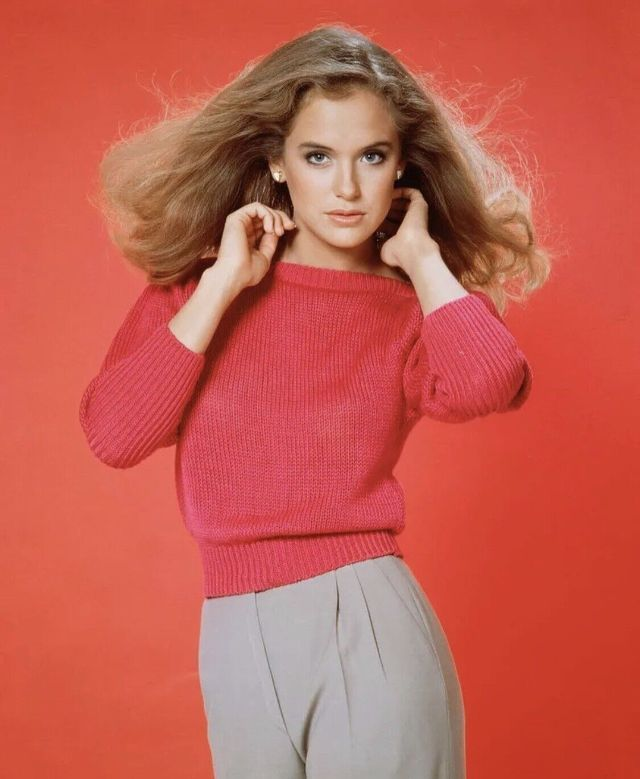

# Abby Palmer

## Name
**Abigail "Abby" Palmer** (née Chen)  
- "Abby" to everyone except telemarketers and her mother
- Eddie calls her "babe" or "Abs" (she rolls her eyes at both)
- Calls Eddie "Palmer" when he's crossed a line
- Calls Doogan "Andrews" when she's annoyed with him
- Daphne calls her "Abs" (only person allowed to besides Eddie)

---

## Role in the Story
**Operations Manager / The Conscience**  
Abby is Eddie's wife and the operational backbone of the rebound specialist business. She's the one who manages logistics, coordinates schedules, handles damage control, and—most importantly—serves as the moral compass for an operation that exists in ethically gray territory. While Eddie books the clients and Doogan performs the emotional work, Abby makes sure nothing falls apart.

She's brilliant at organization, reads people almost as well as Doogan, and has an uncanny ability to anticipate problems three moves ahead. She teases Eddie and Doogan relentlessly about the business, but she's also secretly fascinated by it and occasionally jealous that she's not allowed to play along.

Despite her sharp tongue and the constant roasting of Eddie's fashion choices, she's deeply in love with her husband and fiercely protective of Doogan. They're her family, and the business—morally dubious as it is—keeps them all together.

---

## Personality Traits
1. **Whip-Smart but Plays It Down** – Brilliant strategic thinker who learned early that being "too smart" made men uncomfortable; now weaponizes underestimation
2. **Sarcastically Loving** – Shows affection through merciless teasing; the harder she roasts you, the more she cares
3. **Anxiously Competent** – Worries about everything but channels it into hyper-competent problem-solving (very Leslie Mann neurotic energy)
4. **Secret Romantic** – Pretends to be cynical about the rebound business but is secretly fascinated by the emotional engineering
5. **Impeccable Taste** – Has an eye for the finer things and isn't apologetic about it; loves luxury and knows quality when she sees it

---

## Background
Abby grew up in an upper-middle-class family in the suburbs—country clubs, cotillions, the whole package. Her parents raised her to be smart enough to succeed but not so outspoken that she'd threaten fragile male egos. She learned early to hide her intelligence behind charm and deference, a skill that both served her and frustrated her.

She excelled in college (business and psychology double major) and could have done anything—corporate strategy, marketing, consulting. Instead, she met Eddie Palmer, a charming hustler with a sales pitch for everything and genuine sweetness underneath all the patter. He was nothing like the men her family expected her to marry, which was exactly the point.

Through Eddie, she met Doogan. The three of them clicked immediately—Eddie's energy, Doogan's depth, Abby's sharp intelligence. When Eddie proposed the rebound specialist business, Abby was simultaneously horrified and intrigued. She laid down ground rules, built the operational infrastructure, and became the indispensable third leg of the stool.

She's the one who keeps everything running. She coordinates schedules, manages communications, handles client relations when Eddie oversells, and cleans up the inevitable messes. She's also the one who notices when Doogan's falling apart or when Eddie's avoiding something.

Her friendship with Daphne predates the business—they met at a charity event years ago and bonded immediately. Daphne doesn't know she was Patient Zero, the first rebound job that proved the concept. Abby suspects but has never confirmed it, and the guys have never admitted it. It's the elephant in the room of their friendship.

---

## Physical Characteristics
- **Build:** Gorgeous, 5'7", maintains her figure through Pilates and expensive trainers (which Eddie teases her about while paying the bills)
- **Hair:** Long, rich dark brown (Kelly Preston style), always perfectly styled—she's one of those women who looks effortlessly put together but actually puts in the work
- **Eyes:** Striking green-hazel that see right through bullshit
- **Face:** Classic beauty—high cheekbones, warm smile that can shift to devastating eye-roll in a heartbeat
- **Clothing Style:** 
  - Impeccable, expensive casual—designer jeans, cashmere sweaters, perfect blazers
  - Even her "loungewear" is coordinated (Eddie calls it "aggressive comfort")
  - Loves designer handbags and shoes (Eddie teases her about her closet being "retail therapy headquarters")
  - Always looks camera-ready even at 7 AM (which drives Eddie crazy with admiration)
- **Presence:** Confident, elegant, but also approachable—she can work a room or curl up on the couch with equal ease
- **Distinctive Features:**
  - Killer smile that lights up her whole face
  - Expressive eyebrows that do half her communicating (the Leslie Mann trademark)
  - Perfect posture (those cotillion lessons stuck)
  - Nervous hand gestures when she's anxious (plays with her wedding ring, touches her hair)

---

## Voice & Style
Abby speaks with precision but also warmth. She's got the Leslie Mann neurotic energy—rapid-fire when she's anxious or excited, full of self-aware observations and comedic asides. She's the one who points out the absurdity of situations while simultaneously trying to fix them.

She uses humor as a shield, particularly sarcasm. When she's worried, she gets faster and funnier. When she's angry, she gets quieter and more precise (which is when Eddie and Doogan know they're in real trouble). She's not afraid to be vulnerable, but she usually wraps vulnerability in a joke.

With Eddie, the banter is constant—they finish each other's sentences, interrupt, and engage in rapid-fire teasing that's clearly a love language. With Doogan, she's more gentle but equally direct. With Daphne, she's relaxed and conspiratorial.

**Sample Quotes:**

- "Okay, okay, let me get this straight. You want to take a job rebounding a reality TV star who just got dumped on national television, during sweeps week, while her ex is dating her former best friend. And you think this is *less* complicated than last month? Eddie, honey, I love you, but sometimes I think you confuse 'challenge' with 'career suicide.'"

- "I'm not saying I *want* to do a rebound job. I'm just saying it's interesting, okay? From a psychological perspective. The way Doogan reads people, the way he becomes exactly what they need—it's fascinating. Also, I have great taste and I'm excellent at pretending to be someone I'm not. I did it for twenty years before I met you."

- "Do you know what bothers me about this business? It's not the lying—everyone lies. It's not even the manipulation—marketing is manipulation with better lighting. It's that you two genuinely help these people, and they'll never know it was orchestrated. That's either beautiful or tragic, and I can't figure out which."

- "Daphne's coming over for wine tonight, and I swear to God, Eddie, if you give me that look one more time, I'm going to ask her directly if Doogan ever dated her. Because I *know*. I don't know how I know, but I know. And someday you're going to slip, and when you do, I'm going to say 'I told you so' for approximately six months."

- "You think I like that you do this for a living? You think I enjoy explaining to my mother that my husband is an 'agent' without specifying what kind? But here's the thing—you're good at it. Both of you. You're good at reading people, good at giving them what they need, and yeah, maybe the motivations aren't pure, but the results are real. These people move on. They heal. Even if they don't know why."

---

## Relationships

**Eddie Palmer** – Her husband, her eternal project, the love of her life. They have a combustible, passionate marriage built on constant banter, genuine respect, and physical chemistry. She makes fun of everything about him—his clothes, his networking obsession, his optimism—but she's also desperately in love with him and knows he'd do anything for her. She's slightly afraid of becoming her mother, and Eddie's refusal to be conventional is part of why she married him. Their fights are loud and their reconciliations are passionate. She calls him "Palmer" when she's mad, "babe" when she's soft, and "you absolute idiot" when he's being himself.

**Doogan Andrews** – Her husband's best friend, her friend, her brother-by-choice. She sees through Doogan's brooding artist routine and calls him on his self-sabotage. She knows he's running from something and wishes he'd trust her enough to tell her what. She worries about him more than she lets on—about the toll the work takes, about his inability to connect to anyone real, about the darkness he carries. She uses "Andrews" as a term of both affection and exasperation. When Doogan's falling apart, Abby's the one who shows up with food and forces him to talk.

**Daphne** – Her best friend, her partner in wine and gossip, the person she can be completely herself with. They met at a charity function, bonded over shared frustration with pretentious people, and became inseparable. What Abby suspects but doesn't know for certain: Daphne was Patient Zero, the first rebound job that proved the concept. It's the unsaid thing between them, the suspicion Abby can't quite confirm. She watches Daphne and Doogan interact and knows something happened, but Daphne never talks about the guy who "helped her move on" from her ex, and the timeline is too convenient. Someday Abby will ask directly. But not yet.

**Baxter** – The IT guy she treats like a younger brother. She's gentle with him in ways she's not with Eddie or Doogan, partly because he reminds her of her actual younger stepbrother and partly because she recognizes his genuine sweetness. She's teaching him about quality over quantity (in clothes, food, life) and enjoys having someone who actually listens to her advice.

**Her Mother** – The relationship is complicated. Her mother is proud of Abby's life (successful husband, nice house, good taste) but constantly hints that Abby could do "more" with her education. Abby loves her mother but also rebels against becoming her—the woman who dimmed her own light to make others comfortable.

---

## Motivations
- **Surface Level:** Keeping the business running smoothly, maintaining the lifestyle she enjoys, staying out of legal trouble
- **Deeper Level:** Protecting her chosen family (Eddie, Doogan, even Baxter) from themselves and from consequences
- **Deepest Level:** Proving she's more than the upper-middle-class girl who married down; demonstrating her intelligence matters even if it's in service of something unconventional
- **The Secret:** She's jealous of the work—she wants to play the game, wants to use her intelligence in the field instead of behind the scenes
- **The Fear:** That the business falls apart and exposes Eddie and Doogan, or that Daphne finds out the truth and their friendship is ruined

---

## Humor & Style Notes
Abby is hilarious in the Leslie Mann neurotic-but-grounded way. Her comedy comes from:

- **The Anxiety Spiral** – When she's worried, she spirals into rapid-fire worst-case scenarios that are simultaneously absurd and logical
- **The Loving Roast** – Her affection manifests as merciless teasing, particularly of Eddie's fashion and networking habits
- **The Expressive Face** – Her eyebrows and facial expressions do half the comedy work (pure Leslie Mann)
- **The Self-Aware Commentary** – She narrates the absurdity of their lives while actively participating in it
- **The Shopping Justification** – She can rationalize any purchase as either an investment, a necessity, or emotional self-care (Eddie's learned not to argue)

**Running Gags:**
- Eddie vs. Abby fashion wars ("That's not a color found in nature, Palmer")
- Her shopping habits that she defends with elaborate economic justifications
- Her suspicions about Daphne being Patient Zero (she'll randomly say things like "So Daphne mentioned this guy from years ago..." and watch Eddie and Doogan squirm)
- Her neurotic pre-event preparation (makes lists, color-codes schedules, triple-checks everything)
- The way she shifts between polished society woman and sweats-wearing wine-drinker depending on context
- Her mother's phone calls that always come at the worst moments
- Her secret Pinterest boards for hypothetical rebound scenarios she'll never get to execute

---

## Continuity Links

**Key Episodes:**
- [The First Job](../events/the-first-job.md) – Abby coordinates the logistics that make it possible
- Future episodes will explore:
  - A job that requires Abby's direct participation (she finally gets to play)
  - The Daphne revelation—confronting the Patient Zero suspicion
  - A situation where her upper-class connections become crucial
  - Her relationship with her mother and the expectations she's rejected
  - A client who figures out the operation and threatens to expose them (Abby handles damage control)
  - Eddie screwing up so badly that Abby has to decide if she's in or out
  - A moment where her intelligence saves the entire operation

**Recurring Elements:**
- Weekly Sunday brunch with Daphne (sacred time; Eddie knows not to interrupt)
- Her color-coded digital calendars and backup systems for the business
- The wine-and-debrief sessions where she processes the moral implications with Eddie
- Her shopping trips that Eddie teases her about but secretly loves funding
- The moments when she shifts from sarcastic to genuinely vulnerable
- Her habit of touching her wedding ring when she's nervous
- The ongoing suspicion about Daphne that manifests in conversational fishing expeditions
- Her secret observation of rebound jobs to learn the techniques

**Character Arc Potential:**
The story explores whether Abby can step out from behind the scenes and prove that she's not just the operations manager but an equal partner capable of running her own game. Can she reconcile her love of luxury with the morally ambiguous work that funds it? Can she be honest with Daphne about Patient Zero without losing her best friend? Can she fully embrace the life she's chosen instead of constantly measuring it against her mother's expectations?

The core tension: Abby is brilliant, strategic, and underestimated. She's built a life on her own terms but sometimes wonders if she's still playing by someone else's rules. Her arc is learning to trust her own judgment, claim her space in the operation, and stop hiding her intelligence behind charm and sarcasm.

---
