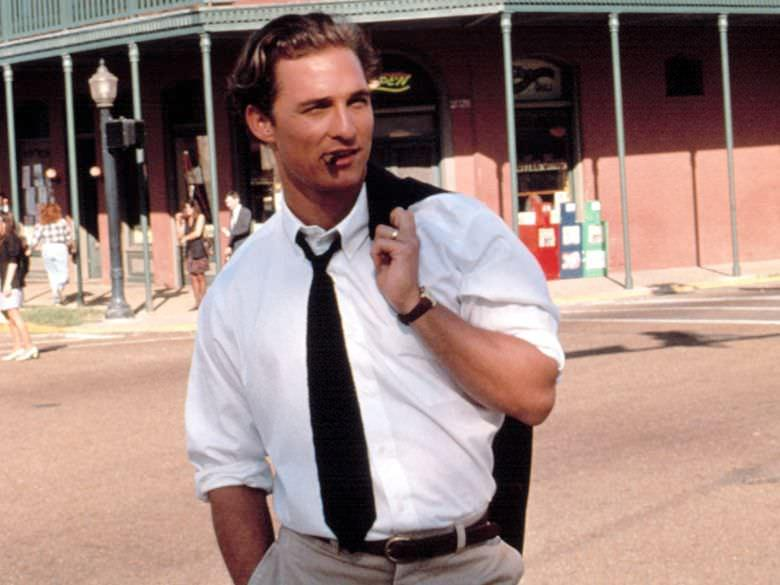

# Doogan Andrews

## Name
**Doogan Andrews**  
- Goes by "Doogan" exclusively—never "Doog" or "D"
- Eddie calls him "the Professor" (mockingly affectionate)

---

## Role in the Story
**Protagonist / "Rebound Specialist"**  
Doogan is the reluctant star of an underground consulting operation that specializes in emotional transitions. Sometimes he's hired by worried friends to help someone damaged get back into dating. Other times it's a manager who needs their client distracted during a crucial project. Occasionally it's family members staging an intervention of the heart. Part emotional therapist, part con artist, and part hopeless romantic, he's the guy who genuinely understands people—and uses that gift in morally questionable ways.

He's the beating heart of the operation, the one who actually connects with the targets (never "clients"—the clients are the ones who hire them). While Eddie handles logistics and Abby manages damage control, Doogan is the artist who reads people, adapts on the fly, and makes the impossible seem effortless. He becomes exactly what his targets need in that moment.

**Business Rules (Non-Negotiable):**
- **Target Demographics:** Doogan ONLY works with heterosexual women as targets
- **Age Parameters:** Targets must be well over 18 and age-appropriate (not senior citizens)
- **Job Duration:** Rebound relationships typically last a few weeks, not months—long enough to rebuild confidence, short enough to remain transitional
- **One Job at a Time:** The team takes one client at a time; Doogan can't maintain multiple "relationships" simultaneously
- **Boundaries:** These are hard lines that Eddie and the team would never consider crossing—they're fundamental to how Doogan operates and who he can help
- **Rationale:** Doogan's gift is understanding and connecting with women in emotional transition. These parameters define the scope of what he does and who he can genuinely help. A rebound relationship that lasts months isn't a rebound anymore—it's a real relationship, which defeats the business model and puts Doogan at risk of catching feelings. *(Established throughout series, refined in Episode 1)*

---

## Personality Traits
1. **Charismatic but Wounded** – Can charm anyone in a room, but there's a sadness behind his eyes that he never explains
2. **Emotionally Perceptive** – Reads people like open books; can identify what someone needs emotionally within minutes of meeting them
3. **Self-Aware and Cynical** – Knows exactly what he's doing is wrong, makes sardonic observations about his own moral compromises
4. **Conflict-Averse** – Would rather smooth things over than confront hard truths, especially about his past
5. **Genuine Despite the Con** – When he falls for someone during a job, it's real—which is both his superpower and his curse
6. **Work Evasion Expert** – Avoids discussing his actual work with targets at all costs; defaults to "consultant" and redirects conversation immediately. The less women know about what he does, the fewer awkward questions come up later. This is standard operating procedure on every job. *(Established in Episode 2, Scene 10)*

---

## Background
Doogan was once headed somewhere legitimate—college degree in psychology, a serious relationship, maybe even a future in counseling. Then something happened. He never talks about it. Not the details.

What's clear: There was a woman. There was betrayal or tragedy or both. And whatever went down left Doogan unable to commit to anything real while simultaneously being exceptional at helping others find connection.

### The First Job
One of the few things he kept from that time: a 1970 Mercury Cougar XR-7 convertible he bought in college from an elderly woman whose husband had passed away. The car had been stored in her garage for years, and she sold it to Doogan for almost nothing because he reminded her of her late husband. It's beat to hell—faded dark blue paint, cracked leather, a soft top with more patches than original fabric, and an engine that requires coaxing—but Doogan refuses to replace it. In Southern California weather with the top down, that rumbling disaster of a car somehow adds to his charm. Eddie constantly tells him they make enough money for an upgrade. Abby makes fun of it relentlessly. Doogan just smiles and keeps driving it.

He drifted into this line of work almost by accident. In college, Eddie and Doogan were fraternity brothers—not trust fund kids, but the ones scraping by surrounded by wealth. The VP of their fraternity (a trust fund kid with everything handed to him) had a problem: he'd been hooking up with a girl from the sister sorority all semester while secretly engaged to a family friend's daughter back home. He needed to end things cleanly without risking the engagement or career prospects the wealthy family promised.

Eddie—who's always had a nose for desperate people with money—pitched a solution. For a price, Doogan would charm the girl, make her grateful for the breakup, make sure she moved on cleanly. Doogan thought it was insane and said no. But they were broke, rent was due, and the Cougar needed a new transmission.

So Doogan engineered a few chance encounters—coffee shop, library, one study session. Made her forget about trust fund boy entirely. She told the VP she was grateful they could both move on and wished him well. She didn't even seem hurt—just relieved someone had actually paid attention to her.

Eddie immediately started pitching Doogan on making it a regular thing. Doogan said no. This was a one-time favor, never again.

But here he is.

Word spread in certain circles. Eddie saw the business opportunity. Abby provided the moral compass (such as it is). Now Doogan's trapped in a cycle—facilitating emotional healing for others while running from his own capacity for it.

The money's good enough to quiet most of his doubts. The work keeps him distracted. And his friendship with Abby and Eddie is the only family he trusts anymore. *(Established in Episode 1, Scene 4)*

---

## Physical Characteristics
- **Build:** Lean and athletic (6'), moves with an easy, unhurried confidence
- **Hair:** Dark brown, slightly wavy, usually a little too long—perpetually looks like he just woke up or just got off a boat
- **Eyes:** Warm hazel that can shift from playful to melancholic in a heartbeat
- **Clothing Style:** Effortlessly casual but deliberate—worn-in jeans, tailored blazers over vintage t-shirts, always looks like he dressed without thinking but actually considers every choice
- **Presence:** Has the Matthew McConaughey slouch—relaxed, approachable, "I've got all the time in the world for you"—but can snap to sharp focus when he's reading someone
- **Car:** Drives a beat-up 1970 Mercury Cougar XR-7 convertible that looks almost as bad as it runs—faded paint, torn top, temperamental engine—but it's his and he loves it
- **Home:** Expensive condo high up in a luxury building in Pacific Point—more urban than the upscale suburbs where Eddie and Abby live. Floor-to-ceiling windows frame the city skyline, with lights stretching toward the coast. The place is immaculate, perfectly decorated with modern urban aesthetic: muted tones, charcoal sectional positioned for the view, exposed brick, dark elegance, low coffee table with fresh flowers (regularly swapped out), tv remote and hardback novel—nothing accidental. Not cluttered, just enough to be interesting but nothing too personal, too messy. It feels like a stage set for a life he doesn't quite live. The kitchen, however, is where he comes alive: soapstone countertop veined in dark simplicity, custom walnut cabinetry, commercial-grade six-burner range with griddle, Sub-Zero fridge, German steel knives, copper pots hanging by size. This space is designed for seduction—cooking for women in his territory, where he controls every detail. It's his superpower and his cage. *(Established in Episode 1, Scene 7)*
- **Covert Earpiece:** Wears a nearly invisible, military-grade communications device sourced by Baxter through questionably legal channels—comparable to CIA/Secret Service equipment. It's so small and flesh-toned that it's virtually undetectable even at close range. Uses bone conduction technology, allowing him to hear without traditional speakers. Doogan wears it almost constantly (except during intimate moments, sleeping, or showering), keeping him connected to the team—primarily Baxter—during operations. *(Established in Episode 1, Scene 2)*
- **Distinctive Features:** 
  - A faint scar through his left eyebrow (origin unknown—he gives a different story every time)
  - Slight Southern lilt to his voice that gets stronger when he's being sincere
  - Habit of running his hand through his hair when he's working through a problem
  - Devastating smile that he weaponizes strategically

---

## Voice & Style
Doogan speaks in a low, measured drawl—he never rushes his words because he's learned that silence makes people reveal themselves. He's a master of the thoughtful pause, the knowing look, the perfectly-timed question.

He blends Southern charm ("Now, darlin', let me ask you something...") with sharp psychological insight ("You're not angry at him. You're angry at yourself for ignoring the signs"). His humor is self-deprecating and observational, often at his own expense.

**Sample Quotes:**

- "Here's the thing about rebound relationships—they're not about finding the right person. They're about remembering you're the kind of person someone could want."

- "I don't lie to them, Abby. I just... give them a version of the truth they're already hoping for. There's a difference." *[beat]* "Okay, there's not. But it sounds better."

- "You want to know my secret? I fall for them. Every single one. For those few days, I genuinely believe this could be something. That's not manipulation—it's just... temporary hope. For both of us."

- "The worst part about understanding people? Knowing exactly what they need and being completely incapable of becoming it long-term."

- "Our clients aren't hiring us out of kindness. That manager doesn't want his starlet 'healed'—he wants her distracted until filming wraps. That's the part that keeps me up at night."

---

## Hobbies & Interests

Doogan is far more well-rounded than he initially appears. While he's socially adept and professionally skilled, his private life reveals layers that most targets never see:

**Sailing:**
- His true passion—loves being on the water
- Owns or has regular access to a sailboat (details TBD)
- The one place where his mind quiets and he can just exist without performing

**Golf & Tennis:**
- Plays both regularly and is quite good at them
- Characteristically humble about his skill level—doesn't brag or lead with these accomplishments
- Uses them as casual date activities when appropriate, but never to show off

**Reading:**
- Broad interests beyond what most people assume
- Doesn't broadcast specific preferences early in relationships

**The Cooking Superpower (The Strategic Secret):**
While Doogan is an exceptional cook with a professionally outfitted kitchen, he **rarely mentions it early** in relationships. It's something women discover organically—often on their second or third date when he invites them to his condo.

**Why He Doesn't Broadcast It:**
- Too personal, too vulnerable to lead with
- Reveals more about him than he wants targets to know upfront
- More effective as a discovery than a promise
- Creates genuine surprise and deeper connection when revealed naturally

**What Makes It Work:**
- **His territory:** The expensive condo with its view of city lights becomes the stage for his most effective dates
- **Controlled environment:** He can be charming and just vulnerable enough to seem real without being messy
- **The performance:** He makes flirty conversation while cooking, lets her sample the food, opens amazing bottles of wine chosen specifically for that woman and that meal
- **The effect:** It creates a complete date experience that feels intimate, personal, and effortless—like he's doing this just for her, not as part of a job

**Why It's Dangerous:**
Cooking for someone is inherently more personal than taking them to a restaurant. When Doogan invites a target to his home and cooks for her, the line between performance and reality becomes even thinner. He's not just playing a role—he's sharing his space, his skill, his taste. The women feel special because they are getting something real from him, even if the setup isn't.

Claire mentioned she'd miss his cooking more than dinners out—a sign that his home-cooked meals made a deeper impression than any restaurant ever could. *(Referenced in Episode 1, Scenes 1 & 2; cooking strategy refined in Episode 2, Scene 10)*

---

## Relationships

**Abby Chen** – His conscience and his anchor. They have a brother-sister dynamic with underlying tension—she sees through all his bullshit, calls him on his self-sabotage, and occasionally hints that she knows more about his past than she lets on. He trusts her completely, which terrifies him. She makes constant fun of his car ("That thing is a tetanus shot on wheels"), but he knows she secretly understands why he keeps it.

**Eddie Katz** – His business partner and the only person who makes him laugh at the absurdity of their operation. Eddie provides comic relief to Doogan's brooding. They balance each other—Eddie's all surface, Doogan's all depth. Eddie's constantly trying to convince him to upgrade the Cougar ("We can afford a car that doesn't require a prayer to start, you know"), but Doogan won't budge.

**The Targets** – He connects with them genuinely, which is the problem. Whether it's a heartbroken actress, a woman navigating a difficult divorce, or a commitment-phobe trying to move on, he sees them, understands them, and gives them what they need in that moment. The line between performance and reality dissolves for him every single time.

**The Clients** – The people who hire them (friends, managers, family) often become complications. They have their own agendas, their own guilt, their own reasons for manipulating someone they claim to care about. Doogan judges them even as he takes their money.

- **Secrecy Rule:** Targets must never be aware they were part of a paid rebound; Doogan and the team never reveal they were hired. All explanations to targets should read as personal connection or coincidental kindness, never as a contracted service.

**His Mysterious Past** – There's someone he doesn't talk about. Someone who broke him or someone he failed. This ghost haunts every connection he makes, regardless of who's on the other side.

---

## Motivations
- **Surface Level:** The money is good, the work keeps him occupied, and he's genuinely talented at it
- **Deeper Level:** Helping others find connection (or at least the illusion of it) is penance for whatever connection he destroyed or lost
- **Deepest Level:** He's terrified of being alone with his own thoughts, so he loses himself in other people's emotional crises instead of confronting his own
- **The Contradiction:** He wants out but doesn't believe he deserves a real relationship, so he stays in the game
- **The Moral Tension:** He knows the clients often hire them for selfish reasons (keep the talent focused, get a friend off their couch, manipulate someone's timeline), but he tells himself he's actually helping the targets heal
- **The Personal Cost:** Sometimes Doogan gets too close and pays for dates himself rather than billing the client—Eddie calls him on this, reminding him "that's the whole point of having a business model." But Doogan can't always maintain the professional distance the work requires. *(Established in Episode 1, Scene 2)*

---

## Humor & Style Notes
Doogan's humor is wry, self-aware, and tinged with melancholy. He makes sardonic observations about the human condition, often while actively participating in the mess.

- **Running Gag:** Every woman asks about the eyebrow scar. He gives increasingly ridiculous origin stories (knife fight in Marrakech, childhood llama incident, freak bookshelf collapse).
- **Ironic Beat:** He's brilliant at crafting romantic moments for clients but terrible at recognizing when someone's actually falling for him
- **Physical Comedy:** Despite his smooth persona, he's clumsy in genuinely emotional moments—knocks things over, trips, fumbles when he's not performing
- **Signature Move:** The "Doogan Pause"—that moment mid-con when he genuinely connects with someone and you can see him questioning everything

---

## Continuity Links

**Key Episodes:**
- [The First Job](../events/the-first-job.md) – Establishes his methodology and his conflict with the work
- Future episodes will explore:
  - A job that goes wrong when he falls too hard
  - A target whose situation mirrors his own past in uncomfortable ways
  - A client whose motives are darker than advertised
  - Abby discovering something about his past
  - A former target recognizing him
  - The revelation of what (or who) broke him

**Recurring Elements:**
- His refusal to discuss his past in specific terms
- The beat-up Cougar that he refuses to replace despite constant mockery from Abby and practical arguments from Eddie
- The way he genuinely transforms during jobs—becomes the man these women need temporarily
- His post-job ritual of sitting alone with a drink, looking haunted (often in the Cougar with the top down)
- The tension between his talent for love and his inability to accept it himself
- His friendship with Abby and Eddie as the only real thing in his life

**Character Arc Potential:**
The story explores whether Doogan can stop running from his past and allow himself to be genuinely seen—not as the charming facilitator of other people's happiness, but as someone deserving of his own.
