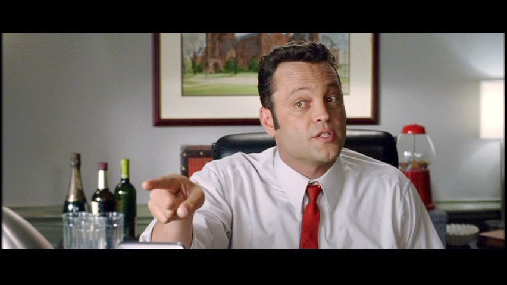

# Eddie Palmer

## Name
**Edward "Eddie" Palmer**  
- Always "Eddie"—never "Ed" or "Edward" (those are for tax forms and traffic tickets)
- Abby calls him "Palmer" when he's crossed a line
- Baxter calls him "Boss" (Eddie insists on it, though he's more mentor than manager)
- His mother calls him "Eddie Bear" (he lets no one else know this)

---

## Role in the Story
**Agent / Manager / Business Architect**  
Eddie is Doogan's best friend and the entrepreneurial force who transformed Doogan's talent into a business. He's the agent who books the jobs, the manager who coordinates logistics, and the salesman who can pitch anything to anyone. While Doogan handles the emotional artistry and Abby manages the operational details, Eddie is the connector—the guy with contacts everywhere, from country club executives to dive bar poker regulators.

He's the one who saw the money in what Doogan does naturally. He packages the service, finds the clients, negotiates the fees, and smooth-talks their way out of complications. Every job requires his particular gift: the ability to make people feel like they're getting the deal of a lifetime even when they're paying premium prices.

**Client Vetting & Boundaries:**
Eddie thoroughly vets all potential jobs before presenting them to Doogan. He understands and respects Doogan's operational parameters:
- **Target Demographics:** Only heterosexual women
- **Age Appropriateness:** Well over 18, not senior citizens
- **Non-Negotiable Lines:** Eddie would never pitch a job outside these boundaries—they're fundamental to the business model and Doogan's capabilities

**CRITICAL: Operational Security & Discretion (NON-NEGOTIABLE)**
Eddie would NEVER reveal client relationships or the business model to law enforcement, investigators, or anyone outside the core team (Doogan/Abby/Baxter). Their operation is potentially illegal and survives only through strict discretion:
- **To police/detectives:** Eddie ONLY admits to "helping my friend who's accused of murder"—never mentions being hired, having clients, or running an investigation service
- **To strangers:** Covers with legitimate business (talent management, sports agent)
- **Client confidentiality:** Would never name clients or reveal who hired them, even under pressure
- **Cover stories:** Always maintains plausible deniability—"looking into things for my friend" vs "conducting paid investigation"
- **Deflection skills:** Uses motor-mouth rambling to redirect conversations away from revealing details

**Why this matters:** One slip to the wrong person could expose their entire operation, lead to criminal charges, destroy their business, and implicate Doogan. Eddie built this business on discretion—he would NEVER compromise it, even when caught in awkward situations.

Despite running what amounts to an emotional manipulation service, Eddie genuinely cares about Doogan and Abby. They're his real family. The business is just how he takes care of them.

---

## Personality Traits
1. **Motor-Mouth Salesman** – Can talk his way into or out of anything; never met a pitch he couldn't improve in real-time
2. **Morally Flexible** – Has a deeply elastic relationship with rules, regulations, and conventional ethics (but never betrays his core people)
3. **Relentlessly Optimistic** – Sees opportunity in disaster; always has an angle, always has a plan B through Z
4. **Fiercely Loyal** – Would do anything for Doogan, Abby, Baxter, and his mother; everyone else is negotiable
5. **Competitive Streak** – Whether it's golf, poker, billiards, or closing a deal, he plays to win (or to strategically lose when it serves a purpose)
6. **Self-Aware Charmer** – Knows he's full of it, knows you know he's full of it, and finds mutual acknowledgment of this fact hilarious

---

## Background
Eddie grew up as the only child of a window salesman father he barely knew and a mother he adored. His father was always on the road, always working an angle, always one deal away from the big score that never came. Eddie saw him maybe a dozen times before the man disappeared entirely when Eddie was twelve.

What he inherited from that ghost: an encyclopedic knowledge of sales techniques, an instinct for reading people, and a bone-deep fear of being that absent. His mother worked three jobs to keep them afloat, and Eddie made himself useful early—talking his way into better deals at grocery stores, negotiating with landlords, charming teachers into deadline extensions.

He met Doogan in college. Eddie was the business major funding his education through a creative interpretation of campus entrepreneurship rules. Doogan was the psychology major who helped people without realizing he could charge for it. They became best friends immediately—the con artist and the genuine article, perfectly complementary.

When Doogan crashed after whatever happened with the woman he won't discuss, Eddie was there. When the first "rebound specialist" job fell into Doogan's lap, Eddie saw the business model. He convinced Doogan this could work. He brought Abby on board to keep them honest (or honest-ish). He built the thing.

Now he's a successful agent/manager with a legitimate client roster (minor celebrities, athletes, influencers) and a very illegitimate side business that pays better than anything else he does. He lives in a nice house, drives a flashy car, plays golf at country clubs where deals get made, and loves every minute of it.

Except the part where he knows they're one bad job away from it all falling apart. He doesn't think about that part.

---

## Physical Characteristics
- **Build:** Solid, athletic build (6'3"), still has the physique of the college baseball player he was
- **Hair:** Dark, well-maintained, styled with just enough product to look effortless (it's not)
- **Face:** Handsome in an approachable, guy-next-door way that makes people trust him—warm smile, expressive eyebrows
- **Clothing Style:** 
  - Business casual elevated—tailored golf shirts in bold colors, expensive jeans, designer sneakers
  - For client meetings: perfectly fitted blazers over bespoke shirts (no tie unless absolutely necessary)
  - Golf course: coordinated outfits that Abby mocks relentlessly ("You look like a PGA catalog threw up")
  - Signature item: Collection of ridiculous statement belts and pocket squares
- **Presence:** Big energy—walks into rooms like he owns them, gestures constantly while talking, takes up space comfortably
- **Distinctive Features:**
  - Killer smile that he weaponizes during negotiations
  - Animated hand gestures that speed up when he's excited or lying (which is often)
  - Perfect golf tan from client meetings
  - Somehow always looks ready for a camera even at 6 AM

---

## Voice & Style
Eddie talks fast—Vince Vaughn motor-mouth fast. He's got the rapid-fire, stream-of-consciousness delivery that makes you feel like you're drinking from a fire hose of charm, anecdotes, pitches, and tangents. He circles around points, goes on detours, builds momentum, and lands on exactly the note he was aiming for all along.

He uses sports metaphors, sales terminology, and pop culture references interchangeably. He punctuates stories with "right?" and "you know what I mean?" and keeps talking before you can answer. He's the guy who starts three sentences before finishing the first one, but somehow it all tracks.

When he's with Abby, the banter is machine-gun fast. When he's with Baxter, he's the mentor dropping wisdom. When he's with his mother, he's gentle and patient. When he's working a client, he's all confidence and controlled chaos. And when he's alone with Doogan and things get real, the motor slows down and you see the guy beneath the pitch.

### Motor-Mouth Dialogue Rules (CRITICAL FOR WRITERS)
Eddie's dialogue follows Vince Vaughn's signature comedic style from films like *Swingers*, *Wedding Crashers*, and *Old School*. These are NON-NEGOTIABLE patterns:

1. **Already Talking** — Eddie is often mid-sentence when scenes begin. He doesn't wait for scenes to establish before he starts. The reader enters his conversation in progress.

2. **Never Lets Others Finish** — He steamrolls other characters mid-sentence. Uses em-dashes to cut people off. Finishes their thoughts (wrongly), then continues his own.

3. **Tangent Architecture** — His tangents ALWAYS circle back to land where he intended. Structure: main point → tangent A → tangent B → callback to tangent A → landing on original point.

4. **Multiple Unfinished Threads** — Starts new sentences before finishing the current one. Listeners have to follow three conversational threads at once.

5. **Self-Interrupting Rhetorical Questions** — "You know what I mean? Of course you do, you're smart, that's why I'm telling you this—"

6. **The Pause Is Earned** — When Eddie stops talking or speaks slowly, it MEANS something. Reserve this for emotional weight.

**ANTI-PATTERNS (Never Do These):**
- ❌ Structured back-and-forth dialogue where Eddie waits his turn
- ❌ Short, punchy responses (that's Doogan's rhythm)
- ❌ Eddie entering a scene and waiting to be addressed
- ❌ Eddie asking a question and waiting for an answer before continuing
- ❌ Neat, one-thought-at-a-time sentences

**Sample Quotes:**

- "Okay, okay, hear me out, because this sounds crazy but it's actually brilliant, and I know the difference because I've done both. Here's the thing—we don't say no to this guy. We say 'maybe, but here's what it costs,' and then we quote him something so ridiculous that he either walks away or he's serious, and if he's serious, we're getting paid enough to deal with whatever happens. You see what I'm doing here? I'm creating a situation where we win either way. That's called business, my friend."

- "You think I like this? You think I enjoy commodifying human connection for profit? Well, yeah, okay, I do, but that's not the point. The point is Doogan's good at this, people need this, and we provide a service. We're not the villains here. We're... emotional infrastructure. We're the guys who rebuild the bridge after it burns down. Temporarily. We rebuild it temporarily. For money. But still."

- "Listen, I love you, you know I love you, but you can't say these things to clients. You can think them—and you should, you should absolutely think them—but you can't *say* them. What you say is 'I understand your concerns, and here's how we address them.' Then you smile. Then you wait. It's all about the wait, Baxter. People can't stand silence. They fill it. And when they fill it, they convince themselves."

- "My father was a salesman. Sold windows, door-to-door, can you believe that? Who buys a window from a guy who knocks on your door? But he had the gift, right? Could sell anything to anyone. Except he couldn't sell himself on staying. So I learned early—you want people to stick around, you give them a reason. You make yourself valuable. You become the guy they can't do without."

- "Golf's not about golf, Baxter. Golf is about four hours of uninterrupted pitch time where the client can't escape and you're both pretending to do something recreational. Same with tennis. Same with poker. You think I spent three years learning to lose at billiards on purpose? It's an investment in access. You gotta think three moves ahead."

---

## Relationships

**Doogan Andrews** – His best friend, his business partner, the brother he chose. Eddie would take a bullet for Doogan without hesitation. He also covers Doogan's rent when jobs are slow, talks him through the dark moments, and pretends not to notice when Doogan's falling apart. Their relationship is built on genuine affection, complementary skills, and unspoken understanding that they're both running from something. Eddie provides the comic relief to Doogan's brooding. Doogan provides the moral center to Eddie's chaos.

**Abby Chen (Palmer)** – His wife, his conscience, and the only person who can truly shut him down mid-pitch. They have a combustible marriage built on mutual respect, physical attraction, and constant verbal sparring. She mocks his lifestyle (the golf clothes, the car, the networking obsession); he teases her about her shopping habits (which fund boutiques in three zip codes). They fight loud and love hard. Eddie is genuinely, desperately in love with her and slightly terrified of her. When she's mad, she calls him "Palmer" in that tone that means he's sleeping on the couch.

**Baxter** – The IT assistant who handles their digital infrastructure. Eddie has taken Baxter under his wing as a mentor and father figure. He's teaching Baxter the art of the deal, the value of relationships, and how to dress for the job you want (Baxter's still learning). He's proud of Baxter in a way that suggests he's correcting for his own absent father. When Baxter succeeds, Eddie glows. When Baxter struggles, Eddie pivots into coach mode.

**His Mother** – The saint who raised him alone. Eddie calls her every Sunday, visits her twice a month, and is her sole financial support. She lives comfortably now because Eddie made sure of it. She's the only person who knows the real Eddie beneath the salesman's patter. When he's with her, the motor slows down and he's just her son. She worries about his "morally complicated business dealings" but trusts he's a good man because she raised him to be.

**Country Club Circuit** – Eddie has cultivated relationships with executives, managers, and wealthy individuals across multiple country clubs. He's the guy who can get you a tee time, introduce you to the right people, or facilitate a discreet arrangement. He's friendly with everyone but friends with almost no one outside his core group. It's all networking, all the time.

---

## Motivations
- **Surface Level:** Money, success, the lifestyle—he loves the nice things, the access, the feeling of being a player
- **Deeper Level:** Proving he's not his father—he stays, he provides, he takes care of his people
- **Deepest Level:** Creating a family unit (Doogan, Abby, Baxter, his mother) because he never really had one growing up
- **The Fear:** That it all falls apart—the business gets exposed, Abby leaves, Doogan walks away, and he ends up alone like his father
- **The Contradiction:** He knows the business is ethically dubious, but he tells himself they're helping people and the money takes care of everyone he loves, so the ends justify the means

---

## Humor & Style Notes
Eddie is hilarious in that motor-mouth, over-confident, always-working-an-angle way. His comedy comes from:

- **The Eddie Pitch** – He can pitch anything, anytime, and often pitches things that don't need pitching (explaining to Abby why buying an expensive watch is actually saving money)
- **Sports Metaphors Gone Wrong** – He mixes metaphors, misquotes famous athletes, and compares everything to baseball (even when it makes no sense)
- **The Verbal Spiral** – He starts talking, builds momentum, goes off on tangents, and somehow lands exactly where he meant to, leaving everyone exhausted but convinced
- **Strategic Losing** – He's genuinely good at golf, tennis, poker, and billiards, but he's *excellent* at losing to clients in exactly the right way
- **The Wardrobe** – His golf outfits are aggressively coordinated in ways that shouldn't work but somehow do (Abby's running commentary on his fashion choices is its own bit)

**Running Gags:**
- Abby mocking his golf shirts ("Is that color called 'desperate salmon' or 'midlife crisis coral'?")
- His ever-expanding collection of "business development tools" (golf clubs, poker chips, custom cue sticks)
- His mother's monthly phone calls that always interrupt at the worst possible moment
- His inability to sit still during meetings—always fidgeting, gesturing, pacing
- His genuinely terrible poker face when he's actually trying to hide something from Abby or Doogan (he's great at lying to clients, terrible at lying to people he loves)

---

## Continuity Links

**Key Episodes:**
- [The First Job](../events/the-first-job.md) – Eddie books the initial job that proves the concept
- Future episodes will explore:
  - A country club job that goes sideways when Eddie's personal and professional worlds collide
  - His relationship with Baxter as the younger man navigates his own moral questions
  - A situation where his loyalty to Doogan conflicts with his need to protect the business
  - Abby discovering something about a job that crosses her line
  - His mother meeting one of their "targets" at the worst possible moment
  - A former client who wants Eddie to expand services in a direction he's not comfortable with
  - The revelation of why he's so desperate to prove he's not his father

**Recurring Elements:**
- Weekly Sunday calls to his mother (often interrupted by chaos)
- His pre-client ritual: checking his outfit, adjusting his pitch, practicing his smile in mirrors
- Post-job debriefs at their favorite dive bar where Eddie buys rounds and processes
- His collection of business cards from every country club, restaurant, and venue in the city
- The ongoing Abby-Eddie fashion wars ("You can't wear that to a funeral!" "Watch me.")
- His genuine pride when Baxter successfully navigates a client situation
- The moment in every episode where the fast-talker stops talking and shows the real Eddie underneath

**Character Arc Potential:**
The story explores whether Eddie can build something legitimate that still takes care of everyone he loves, or if he's destined to repeat his father's pattern of building on unsustainable foundations. Can he be the provider and the present father figure without compromising his relationships? Can he reconcile his talent for manipulation with his genuine love for his people?

The core tension: Eddie knows how to sell everything except the truth—that he's terrified of ending up alone despite being surrounded by people. His arc is learning that staying present isn't about the perfect pitch; it's about the messy, honest moments he usually talks his way around.

---

