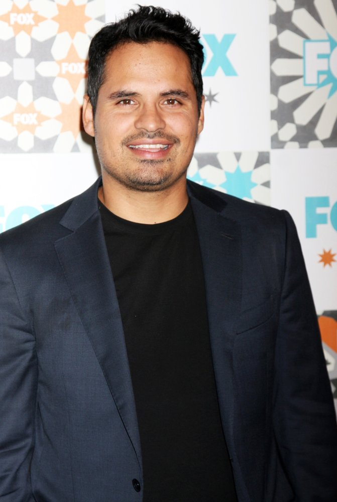

# Detective Paul Martinez

## Name
**Paul Martinez**  
- Goes by "Paul" or "Detective Martinez"
- Colleagues occasionally call him "Paulie" though he doesn't encourage it
- His kids call him "Papa"

---

## Role in the Story
**Lead Detective / Moral Compass**  
- The primary law enforcement officer investigating the crimes and conspiracies in Pacific Point
- Serves as the story's ethical center—the one honest cop in a world of grifters and opportunists
- Functions as both obstacle and reluctant ally to Doogan, representing legitimate law enforcement against Doogan's morally flexible methods
- His investigations often parallel or intersect with Doogan's cases, creating tension and unexpected collaboration

---

## Personality Traits
- **Principled** – Has a strong moral code and plays by the rules (most of the time)
- **Persistent** – Doesn't let cases go, even when they get complicated or politically messy
- **Pragmatic** – Understands the world isn't black and white, but still tries to do right by it
- **Fair-minded** – Gives people the benefit of the doubt until they prove otherwise
- **Dry-witted** – Has a subtle, understated sense of humor that catches people off guard

**Strengths:** Integrity, investigative instincts, ability to read people, calm under pressure  
**Weaknesses:** Can be too trusting, sometimes lets his moral code slow him down, struggles with the grey areas where Doogan operates

---

## Background
Paul Martinez grew up in East LA, where he met his wife Maria while they were both attending Cal State LA. They bonded over shared roots, family values, and a desire to build something better. After graduating with a degree in criminal justice, Paul joined the LAPD but eventually moved his growing family to Pacific Point for a better quality of life—less gang violence, better schools, ocean views.

He's been with the Pacific Point Police Department for twelve years and made detective seven years ago. He's built a solid reputation as a straight shooter who closes cases without cutting corners. While he loves the coastal lifestyle, he stays connected to his Mexican heritage through family gatherings, cooking, music, and frequent trips back to East LA to visit extended family.

Paul genuinely believes in the job. He became a cop to help people and solve problems, not for power or glory. In a town increasingly defined by wealthy transplants, shady real estate deals, and white-collar crime, he remains one of the few people you can actually trust.

---

## Physical Characteristics
**Based on Michael Peña:**
- **Height/Build:** 5'9", compact and athletic build, moves with quiet confidence
- **Face:** Warm brown eyes that can shift from friendly to intensely focused; expressive eyebrows; clean-shaven with a strong jawline
- **Hair:** Dark brown to black, kept short and neat, occasionally showing hints of grey at the temples
- **Style:** Practical and unpretentious—usually wears business casual (button-downs, slacks, occasionally a blazer for formal interviews), comfortable shoes for chasing down leads
- **Presence:** Approachable but authoritative; has a disarming smile that puts people at ease before he asks the hard questions
- **Distinctive features:** Warm, genuine smile that reaches his eyes; tends to tilt his head slightly when listening carefully; has a habit of crossing his arms when skeptical

---

## Voice & Style
Paul speaks clearly and directly, without unnecessary embellishment. His tone is calm and measured, even when dealing with difficult suspects or frustrating situations. He's fluent in Spanish but speaks English without a Mexican accent—pure Southern California inflection. His humor is subtle, often delivered deadpan, and easily missed if you're not paying attention.

**Sample Quotes:**
- "I'm not here to judge you. I'm here to figure out what happened. Big difference."
- "You know what I love about this town? The criminals think they're too rich to get caught. Makes my job easier."
- "Doogan, one of these days you're going to tell me the truth by accident, and I'm not going to believe you."
- "Eddie, if you spent half as much energy on being honest as you do on being creative, you'd probably be a decent person."

---

## Relationships

**Doogan Andrews:**  
Paul is perpetually suspicious of Doogan but can't quite dislike him. He knows Doogan operates in moral grey areas, bends rules, and probably commits light crimes regularly, but he also recognizes that Doogan occasionally gets results and has his own warped sense of honor. Their relationship is defined by mutual wariness and grudging respect. Paul secretly appreciates that Doogan sometimes uncovers information he can use, even if he'd never admit it.

**Eddie Palmer:**  
Paul sees Eddie as a sleazebag and assumes it's only a matter of time before he arrests him for something substantive. He tolerates Eddie because of the man's connections to ongoing cases, but he watches him carefully. Paul doesn't buy Eddie's charm offensive and finds his moral flexibility exhausting.

**Abby Palmer:**  
Paul feels sympathy for Abby, seeing her as someone who got dealt a tough hand (Eddie as a husband). He respects her intelligence and wit, and occasionally worries she's being pulled into situations she shouldn't be involved in.

**Rodney Baxter:**  
Paul finds Rodney frustrating—too slippery, too connected, too good at appearing legitimate while clearly being dirty. Rodney represents everything Paul dislikes about Pacific Point's elite class.

**Maria Martinez (his wife):**  
His anchor and best friend. She keeps him grounded, calls him out when he's being too rigid, and reminds him why they moved to Pacific Point in the first place.

---

## Motivations
Paul is driven by a genuine desire to serve and protect. He wants to solve crimes, help victims, and maintain order—not for glory or advancement, but because it's the right thing to do. He's motivated by justice, but also by providing for his family and creating a safe community for his four kids to grow up in.

Unlike many characters in the story, Paul isn't chasing money or status. He wants to close cases, go home to his family, and sleep with a clear conscience. This makes him both admirable and occasionally predictable—he'll always choose the ethical path, even when it's harder.

---

## Humor & Style Notes
Paul's humor is subtle and easy to miss. He delivers dry observations with a straight face, often catching people off guard. His comic beats come from being the only sane person in a room full of schemers, liars, and con artists. 

**Comic/Ironic Beats:**
- His calm, rational responses to Doogan's chaos highlight the absurdity of situations
- He occasionally lets slip a perfectly timed deadpan comment that undercuts someone's bullshit
- His exasperation with Eddie is a running gag—he sighs, shakes his head, and moves on
- Despite being the most ethical person in the story, he ends up inadvertently benefiting from Doogan's rule-breaking

---

## Continuity Links
- Paul appears in any scene involving official police investigations or interrogations
- He's the voice of institutional law enforcement, providing contrast to Doogan's freelance approach
- His relationship with Doogan should evolve from suspicion to cautious cooperation over the course of the story
- His family life (wife Maria, four kids) should be referenced occasionally to ground his character and remind readers of his stakes
- His Mexican heritage is important but not stereotyped—shows up in cultural references, food, music, family gatherings
- He speaks Spanish when needed (with family, certain witnesses, suspects) but it's naturalistic, not performative
- His investigation into [The First Job](../events/the-first-job.md) or other central crimes should run parallel to Doogan's involvement

**Key Recurring Elements:**
- Paul's skeptical head tilt when someone's lying
- His patient, methodical interview style
- References to his wife Maria keeping him grounded
- His understated exasperation with Eddie
- His conflicted relationship with Doogan (wants to arrest him, kind of respects him)
