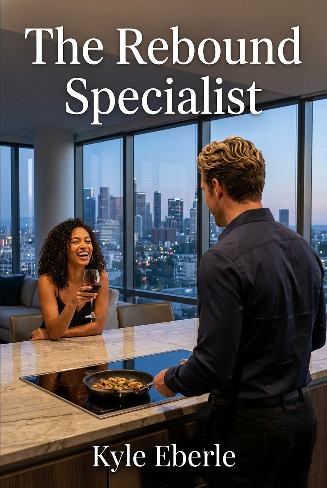

\newpage

## 1

Two hours in a holding cell and Doogan had memorized the graffiti.

*Julio (heart) Dominique*—carved into cinder block with what looked like a key or maybe a belt buckle. Nice of Julio to declare that.

The holding cell had no furniture. Just walls and floor and the smell of industrial cleaner—ammonia and bleach—trying to kill something older and worse beneath it. Sweat. Piss. Fear.

His legs burned. Standing welded his knees together, locked the joints until his thighs trembled with the effort of staying upright. He shifted weight. Left foot. Right foot. The concrete floor radiated cold through his soles.

The door opened.

"Let's go."

Detective Paul Martinez stood in the doorway, notepad already in hand, expression patient. His partner—Detective Peter Finch—lingered behind him, older and harder, wearing his cynicism like a favorite jacket.

Doogan pushed off the wall. Followed them down a fluorescent hallway—lights hummed too loud, high-pitched whine that drilled into his skull. Interview room three doors down. Scarred table. Three metal chairs. One-way mirror reflecting his own face back at him, haggard and gray under the lights.

Martinez sat. Pointed to the chair.

Doogan sat. Cold metal bit through his jeans, shocked his spine. He kept his face still.

Finch leaned against the wall, arms crossed.

"Walk me through the evening," Martinez said.

"Had dinner. Talked. Went to bed. Woke up, she was dead, you showed up."

"From the top. How'd you meet Annabelle Anders?"

"Saturday. Farmer's market."

"Which one?"

"Downtown. The one on Sixth."

"You go there often?"

"First time."

"First time at that market and you just happen to run into her?"

"Her dog found me, actually. White poodle. Very friendly."

Finch straightened off the wall. "So you met the dog first."

"Dogs like me."

Martinez flipped a page. "What'd you talk about?"

"Tomatoes. She thought I was weird for caring about produce."

"Were you?" Finch asked.

"Was I what?"

"Weird about the produce."

"I was shopping. She made it sound weird."

"And after the tomatoes?" Martinez kept his tone level. Conversational. Like they were discussing a grocery list.

"Saw each other again later. Different store. Gelson's."

"Another coincidence."

"Southern California. Everyone shops at Gelson's."

"And that's when you made your move?" Finch's voice had an edge now. "Produce section pickup routine?"

"She invited me to cook dinner. I said yes."

"Just like that."

"Just like that."

Martinez leaned forward slightly. "What'd you make?"

"Risotto. Shrimp."

"Fancy."

"Not really. Risotto's just rice and patience."

"You cook for a lot of women?"

"Some."

"Define 'some.'"

"Enough that I'm good at it. Not so many that I've got a system."

Finch snorted. "Sounds like a system to me."

Doogan met his eyes. "Cooking's not a crime."

"Neither is coincidence." Finch pushed off the wall, moving closer. "Until you stack enough of them together. Then they start looking like a plan."

Martinez cut in before Finch could build momentum. "The dinner. What'd you drink?"

"Wine."

"What kind?"

"White. She had it already."

"Remember the label?"

Doogan tried to pull it up. Exhaustion made his memory fuzzy—edges blurred, details swimming out of focus. "Woodmark something. Custom label. She said a client or a rep gave it to her."

Martinez and Finch exchanged a look. Brief. Loaded.

"Client?" Martinez's voice sharpened—first crack in his patient facade. "Annabelle was a receptionist."

"That's what she told me. It's probably still in her kitchen."

"It's not." Martinez replied, slower this time.

Doogan's pulse spiked. Heat flooded his chest. "It's not... there?"

"No idea. Receptionists don't usually get custom-label wine from clients."

"I noticed that too. It's gone?"

Finch leaned in now, hands flat on the table. "You noticed that. But you didn't ask about it?"

"I asked. She said the company rep gave it to her. I let it go."

"Why?"

"Because we were having a nice evening and I didn't want to interrogate her over a bottle of wine."

"Unlike us," Finch said, that wrong smile back.

"Unlike you."

"How much did you drink?" Martinez again, redirecting.

"One bottle between us. Maybe a glass and a half each."

"She open a second bottle?"

"No."

Finch straightened. "You sure about that?  Maybe that bottle disappeared too."

"Yeah, I'm sure. One bottle. White. We didn't finish it."

Martinez pulled out his phone. Swiped. Turned it toward Doogan. A photo of Annabelle's kitchen—clean counters, empty sink. No bottle.

Doogan stared at the photo. His throat tightened. Someone had been in that kitchen. After. While he was unconscious. Moving evidence. "I don't know. It was there."

Martinez took the phone back. Made a note. "What'd you talk about during dinner?"

"Her dog. Her job—briefly. Travel. Nothing heavy."

Doogan lied. He'd asked questions, lots of them. Trying to build the profile he needed for the rebound. But Martinez didn't need to know that.

"She mention anyone at work? Problems? Ex-boyfriends?"

"No."

"Phone calls that night?"

"She checked her phone a couple times. Nothing that seemed off."

"But you noticed."

"I notice things."

"So do we." Finch said it like a threat.

"Bothered you?" Martinez cut in.

"Not enough to say anything."

Finch leaned back against the wall, studying Doogan like a specimen. "So let me get this straight. You meet this woman at a farmer's market—first time you've ever been there. You run into her again at a grocery store. She invites you over. You cook. You drink. You sleep together. And the next morning she's dead. That about cover it?"

Doogan's stomach clenched. "I don't... know."

"Which part?" Martinez sat up straighter.

"I think... I blacked out before anything happened."

The room went still. Not silence. Worse. The kind of quiet that came right before everything broke.

Finch's eyes narrowed. "You know we'll examine the body."

"Please do." Doogan held his gaze. Let him see certainty. Truth.

"And you expect us to believe that's all just bad luck?" Martinez brought the conversation back, voice calm. Reasonable. Dangerous.

"I expect you to do your job and figure out who actually killed her. Because it wasn't me."

"Everyone says that."

"Not everyone wakes up after blacking out, next to a body."

The fluorescent lights buzzed. Doogan's exhaustion was catching up—adrenaline crash from whenever this nightmare had started. Three hours ago? Four?

Martinez stood abruptly. "I'll be right back."

He walked to the door. Knocked twice. It opened. He stepped into the hallway.

Finch stayed put. Eyes on Doogan. Silent now. Letting the quiet do the work.

Doogan leaned back in the chair. Closed his eyes for just a second.

"Tired?" Finch asked.

"Wouldn't you be?"

"Depends. If I'd just strangled someone, I might be pretty wired."

"Good thing I didn't strangle anyone."

"That's your story."

"That's the truth."

"Truth's a funny thing. Means different things to different people."

"Not to me."

"No?" Finch tilted his head. "What's it mean to you?"

"Whatever happened in that apartment while I was unconscious."

"Unconscious. That's an interesting word choice."

"It's the accurate word choice."

"Or the convenient one."

The door opened. Martinez stepped back in, expression different now. Not suspicious. Just neutral. Professional.

"Interview's over."

Doogan blinked. "What?"

"You've got a lawyer. We're done."

"I don't have a lawyer."

"Someone disagrees." Martinez gestured toward the door. "You're free to go. For now. Don't leave town."

Finch pushed off the wall. Moved toward the door. Stopped next to Doogan's chair. Close enough that Doogan could smell coffee and cheap aftershave.

"Innocent people don't lawyer up before sunrise."

He walked out.

Martinez held the door. Waiting. His face gave away nothing—no sympathy, no suspicion. Just a man doing his job.

Doogan stood. His legs wobbled—barely, just a tremor. He forced them steady.

"Don't make me come looking for you," Martinez said.

"Wasn't planning on it."

"Good."

---

\newpage

## 2

"Told you he'd lawyer up, I said it the second we walked in, guy like that doesn't sit in a holding cell without making a call." Finch said as Martinez was already walking away, down the hall.

"Wouldn't you?  Wouldn't I?  Wouldn't all of us in that situation?" Martinez said as his voice trailed off down the hallway.

Eddie was mid-sentence when Doogan stepped into the hallway. His best friend stood next to a man in a suit that looked like it came from a going-out-of-business sale circa 2003.

"Doogan Andrews." The man extended his hand like he was serving a subpoena. "Hank Stillman. I'm your attorney."

Doogan shook his hand. "I didn't call an attorney."

Hank Stillman was a heavyset man in an ill-fitting taupe suit and worn black shoes. He was sweating at 9am, which was impressive even in Southern California.

"Eddie called me." Hank pulled a business card from his breast pocket and handed it over with the practiced efficiency of a parking meter dispensing a receipt. "We need to talk. Not here."

Finch approached from the end of the hallway.

Hank raised his voice enough. "My client has nothing further to say at this time."

"Wasn't asking," Finch said.

Eddie stepped in, always the buffer. "Appreciate the professionalism, Detective. We'll be in touch if anything comes up."

Finch's expression didn't shift. "Don't leave town, Mr. Andrews."

"Wasn't planning on it."

"Good."

Hank gestured toward the exit. "Let's go."

They walked down the fluorescent hallway—Hank in front, Eddie beside Doogan, Finch watching from his post. The station smelled like burned coffee and something industrial. Doogan's legs felt uncertain. His shirt still stuck to his back.

Outside, the morning light hit like a slap. Doogan blinked against it.

Hank stopped on the sidewalk. Pulled out a notepad. "Three rules. Don't talk to cops without me. Don't leave the county. Don't do anything stupid."

"Define stupid." Doogan asked.

Hank looked up from his notepad. "Talking to the police without me present. Going near the victim's apartment. Trying to investigate this yourself. Any of those qualify."

Eddie shifted his weight. "He's good at following rules."

"Then this should be easy." Hank clicked his pen. "What matters is what they can prove and what they can't. Right now, they have circumstantial evidence. You were at the scene. You had opportunity. They'll build motive if they can find one. Our job is to make sure their case falls apart before it gets to a jury."

"I didn't do it."

"Good. Let's keep it that way." Hank's tone was flat, transactional. Not reassuring, just matter-of-fact.

"How much is this going to cost?" Doogan asked.

"My retainer is fifteen thousand. That covers initial filings, arraignment if it comes to that, and preliminary hearings. Trial costs more."

Eddie made a noise. "Fifteen—"

Hank held up a hand. "I'm not the cheapest, but I'm available and I know the system. You want a public defender, be my guest. You'll get someone who's handling forty cases and doesn't remember your name."

Doogan looked at Eddie. Eddie's expression said *we'll figure it out*.

"Fine," Doogan said.

"Good." Hank made a note. "I'll need payment within forty-eight hours. After that, we start building your defense. In the meantime, follow the rules I just gave you. Don't talk, don't travel, don't get cute."

He handed Doogan another business card. "My cell's on the back. Call if the police contact you. Call if you remember anything useful. Don't call to chat."

"Wasn't planning on it."

Hank closed his notepad. "Eddie has my information. We'll be in touch."

He walked toward a sedan that looked as tired as his suit. Got in. Drove away.

Eddie waited until the car turned the corner. "So that went well."

"He mentioned money a lot."

"Lawyers do that." Eddie ran his hand through his hair. "We'll cover it. The business has been good. We've got savings."

"I'm not taking your savings."

"You're not taking anything. We're using business funds to handle a business problem. You getting arrested affects all of us."

Doogan leaned against a lamppost. The exhaustion was catching up—bone-deep, the kind that came from adrenaline crashes and fluorescent lights and holding cells with no furniture. His body ached. His mind felt slow.

"Thanks for coming," he said.

"You called me. What else was I going to do?" Eddie's voice had an edge—not anger, just the sound of someone who'd been woken at three in the morning with terrible news. "Got your one phone call and I hear 'I'm in a holding cell, they think I killed someone, get me a lawyer.' So I googled criminal defense attorneys. Hank was the first one who answered at three in the morning. Baxter ran a quick check to make sure he at least passed the bar."

"And did he?"

"Barely, from what Baxter found, but yeah." Eddie shrugged. "Look, he's not great, but he showed up. That counts for something. He'll keep you out of jail while we figure out what actually happened."

Doogan looked at the station behind them. Martinez was visible through the glass doors, talking to another detective. Finch, probably. Comparing notes. Building a case.

"They think I killed her," Doogan said.

"I know."

"I didn't."

"I know that too." Eddie's voice was steady. Certain. "Which is why we're going to figure out who did. But first, you need to sleep. And shower. You look like hell."

"Feel worse."

Eddie pulled his car keys from his pocket. "Come on. Abby's making pancakes."

"It's six in the morning."

"She's been up since three. Figured she'd do something productive." Eddie started walking toward the parking lot. "Besides, pancakes fix most things."

"Not murder charges."

---

\newpage

## 3

"—so Hank costs money, obviously, lawyers don't work for friendship, which means you need to work, which I know sounds insane considering you were literally arrested this morning but the Billings still want their wedding weekend handled—"

Eddie was mid-sentence when Doogan walked into the kitchen. Abby stood at the stove, flipping pancakes—sharp flips, impatient scrape of spatula against griddle. She didn't turn from the stove.

"Morning, Doogan." Her voice was flat. "Coffee's on the counter. You look like hell."

"Thanks."

"I'm being generous."

Eddie gestured toward the island where a plate of pancakes sat steaming. "Sit. Eat. We've got a situation."

"The situation being I was arrested for murder."

"That situation we're calling 'handled for now.'" Eddie poured himself more coffee. "Hank's on it, you're out, Martinez doesn't have enough yet. The *new* situation is you have a job starting this weekend."

Doogan sat. The pancakes smelled good. He couldn't remember the last time he'd eaten.

"Billings wedding weekend," Eddie continued. "Keep the maid of honor from detonating the 'social wedding of the season.' Her name's Cheryl, older daughter, apparently a landmine waiting to go off—"

"Eddie." Abby's voice was sharp. "He just got out. Give him thirty seconds."

Eddie paused. Looked at Doogan. "You good?"

"I'm good."

"You sure? Because you look—"

"Like hell. Abby mentioned it."

"I was going to say 'tired,' but yeah, also that."

Abby slid a plate in front of Doogan. She set down maple syrup.

Doogan cut into the stack. Took a bite. He barely registered the flavor. His mind was still in that interview room, still hearing Finch's voice.

*The guilty ones always have lawyers.*

"Friday through Sunday," Eddie continued. "Scavenger hunt at the country club, rehearsal dinner, ceremony, reception. Keep Cheryl from making a scene. Cover story is you're a family friend, a fix-up date for the weekend."

"What kind of scene?"

"They didn't specify. Just said she's been 'difficult.'"

"So a babysitting job."

"A *very well-paid* babysitting job." Eddie raised his eyebrows. "Hank wants fifteen thousand within forty-eight hours, and that's just the retainer. If this goes to trial—"

"It won't." Doogan took another bite of pancake. Still couldn't taste it.

Abby pulled out the barstool next to him and sat.

"You don't know that," she said. "Martinez seemed pretty convinced."

"Martinez is doing his job. Finch is an asshole. Neither of them has enough evidence."

"They have you at the scene. They have opportunity. If they find motive—"

"They won't."

"Because there isn't one, or because Hank will make sure they don't find it?"

Doogan looked at her. Abby's eyes were steady, concerned but not pitying.

"Because there isn't one."

She studied him for a moment, then nodded.

Eddie cleared his throat. "The Billings want to meet for dinner later. Wedding planner will introduce you to Cheryl at the first event Friday morning, before the rehearsal."

"And while I'm babysitting a bridesmaid, what are you doing?"

Eddie and Abby exchanged a look. The kind of look that meant they'd already had this conversation and agreed on a plan.

"We're going to figure out what actually happened to Annabelle," Abby said. "Or at least enough to get you cleared."

"Sebastian hired us to rebound her. He's the obvious starting point."

"Which is why we're not starting there." Eddie pushed off the counter. "We start with Annabelle. Who she was, where she worked, who wanted her dead. Sebastian's involved, obviously, but we don't know how yet. We go in asking about him directly, we tip our hand."

"Baxter's already running background checks," Abby added. "Social media, employment history, known associates. We'll find the connection."

Doogan finished the pancakes. Pushed the plate away. The exhaustion was catching up—bone-deep, the kind that came from adrenaline crashes and fluorescent lights and holding cells with graffiti about Julio and Dominique.

"I should get home. Shower."

"Yeah, you really should." Abby's tone was gentle. "You've got the Cougar?"

"Still parked near Gelson's. Where I left it Monday night."

Eddie winced. "Right. When you went to—" He stopped himself. "We'll figure out a ride situation."

"Doogan." Abby waited until he looked at her. "We're going to figure this out. Okay? You didn't do this. We know that. We're going to prove it."

He nodded. Didn't trust himself to say anything.

Abby refilled Doogan's coffee without asking.

"You blacked out," she said quietly.

"Yeah."

"Before anything happened."

"Yeah."

"That's not normal."

"I know."

"The wine."

"Probably."

She wrapped both hands around her mug.

"Eddie's worried," she said. "He's trying to act like it's just another job, but he's worried. He thinks someone set you up."

"Someone did."

"Do you know who?"

"No."

She nodded slowly. "But you have an idea."

Doogan looked at her. Abby was sharp—sharper than she let most people see.

"I have an idea and it starts with our mysterious client."

Eddie appeared in the doorway, phone to his ear. "—yeah the cops took it when they booked him—" He listened. "Perfect. Bring it by his place this afternoon."

He ended the call. "Baxter's got a replacement earpiece. He'll bring it by your place later."

"Good."

"Yeah." Eddie's tone softened. "Look, I know this is a lot. But the Billings job is straightforward. Keep the maid of honor happy, collect the check. You can do this in your sleep."

"I'd prefer to do it awake."

"Then go home, shower, get cleaned up. Baxter will bring the earpiece. We're meeting the Billings for dinner tonight."

Doogan stood. His legs felt uncertain.

"Thanks," he said. "Both of you."

Abby smiled. "That's what family's for. Pancakes and bail money."

"I wasn't actually arrested.  I was taken in for questioning."

"Close enough."

Eddie grabbed his keys from the counter. "Come on. I'll take you to get your car."

Doogan headed for the door. Behind him, he could hear Abby's voice, quieter now.

"You really think he'll be okay for this job?"

"He has to be." Eddie's response was equally quiet. "We need the money. And honestly? Working will be better than sitting around thinking about that interview room."

"He blacked out, Eddie. Someone drugged him and killed a woman while he was unconscious."

"I know."

"And we're sending him right back into the field."

"I know."

A pause.

"He's tougher than he looks," Eddie said finally. "And he's got us. We'll figure this out."

"You keep saying that."

"Because it's true."

---

\newpage

## 4

Doogan's condo was exactly how he'd left it Monday evening—immaculate, staged, empty.

The shower was hot. He stood under it longer than necessary, letting the water run over him, trying to wash away the smell of industrial cleaner and interrogation rooms and exhaustion.

He'd been in bad situations before. Close calls. Jobs that went sideways. But this was different.

This was someone trying to destroy him.

And whoever it was knew exactly how.

The wine. The blackout. The timing.

Someone had studied him. Learned his patterns. Set him up perfectly.

Sebastian was the obvious answer. But did Sebastian have the sophistication for this? He seemed too detached. Didn't even know basic details about Annabelle.  Didn't seem like the ingredients for a grudge killing, even if it included a framing.  It didn't make sense.

Doogan turned off the water. Dried off. Got dressed in clean clothes that didn't smell like a police station.

The knock came twenty minutes later. He opened the door to find Baxter standing there—hoodie, sneakers, small equipment case in hand.

"Hey. Eddie said they took your earpiece when they booked you."

"Standard booking procedure, apparently."

"Yeah, well, I've got a replacement." Baxter stepped inside, setting the case on the kitchen island. He opened it—inside, nestled in foam cutouts, were three nearly identical flesh-toned devices. He pulled one out carefully. "This one's calibrated the same as your original. Bone conduction, encrypted channel, battery life is about forty-eight hours continuous."

He handed it over. Doogan took it—barely weighed anything, practically invisible.

"Put it in. I'll run a quick sound check."

Doogan inserted the earpiece. It settled into place like it always did, comfortable and undetectable.

Baxter pulled out his phone, tapped something. "Testing. One two three."

Baxter's voice came through clear, slightly tinny but perfectly audible.

"Good?"

"Good."

"Okay. You're all set." Baxter pocketed his phone. Looked at Doogan with that earnest, analytical expression he always had. "Eddie filled me in. On the arrest. And the job Friday."

"Yeah."

"I'll be monitoring the full time. Anything you need—research, background, tactical support—I'm there."

"Thanks, Baxter."

"Also—" Baxter hesitated. "The one they took. When they booked you. You know they're going to look at it, right? Try to figure out what it is."

Doogan hadn't considered that. "It's not exactly standard consumer electronics."

"No. It's definitely not." Baxter's expression shifted—worried, analytical. "The IT guys at a police station won't recognize it. But if they send it somewhere with better resources, or if Martinez gets curious enough to ask questions..."

"Then I'll deal with it."

"Just—if he asks, it's a custom hearing assist device. Japanese company. Very niche. I can create a paper trail if I need to."

"Baxter."

"Yeah?"

"I'll handle it."

The kid nodded. Packed up his equipment case with careful, precise movements. "Eddie's waiting downstairs. He's got your keys—we grabbed the Cougar on the way here."

"Thanks."

"Get some sleep. This weekend's going to be intense."

Baxter headed for the door, then paused. Turned back.

"Doogan?"

"Yeah?"

"We're going to figure out who did this. Eddie and Abby are already digging into Annabelle's background. We'll find the connection."

"I know."

Baxter nodded once, then left.

Doogan stood alone in his immaculate condo. The city stretched out beyond the windows. His Cougar was parked in the building's garage. The earpiece sat comfortably in his ear. Essential equipment, back in place.

Friday he'd be back on the job and pretending all of this never happened.

And Eddie and Abby would dig into Annabelle's life and figure out who'd set him up.

Simple.

Except nothing about this was simple.

Someone had studied him. Learned his patterns. Engineered a perfect frame.

And somewhere out there, that someone was watching to see if it had worked.

---

\newpage

## 5

"So the beauty of this situation, and I mean this sincerely, is that you're getting the absolute best at emotional management during what I understand is a very delicate family moment, and Doogan here has handled situations way more complicated than a wedding weekend, which I'm not saying your wedding is simple, obviously it's the social event of the season, you said that yourself and I believe you, but what I'm saying is he's seen it all, done it all, and you're in excellent hands, Tom."

Eddie was mid-pitch when Thomas Billings spoke up.

"It's Thomas."

Eddie stopped mid-pitch. Blinked. "Sorry?"

"Thomas. Not Tom." His voice was even, controlled. The kind of correction that had been made a thousand times and would be made a thousand more. "I prefer Thomas."

"Right. Thomas. Absolutely." Eddie's smile didn't falter. "My apologies. As I was saying—"

"How much?" Sylvia Billings asked.

She sat next to her husband—perfectly styled blonde hair, tailored dress. Jewelry caught the restaurant's soft lighting when she moved, deliberate sparkle that said *money*.

Eddie paused. Recalibrated. "Well, that depends on the scope—"

"Scope is the weekend. Friday morning through the reception Saturday night. Keep our daughter from making a scene." Thomas folded his hands on the table. "How much?"

Doogan watched them both. Thomas had the posture of someone who'd bought a lot of things in his life and knew exactly what they cost. Sylvia had the expression of someone who'd watched him negotiate those purchases and learned his patterns.

"Let's get through the details and I'll get back to you with an estimate later tonight and that will include expenses, there are always expenses." Eddie said.

Thomas didn't blink. "Fine."  Money wasn't what they were really asking about but details.  This was a legitimacy test and Eddie had passed.

Eddie's smile widened. "Excellent. Now, to clarify the scope you mentioned—when you say 'keep our daughter from making a scene,' what exactly are we talking about?"

Sylvia leaned forward slightly. "Cheryl can be... difficult."

"Difficult how?"

"Competitive." Thomas said it like it was a diagnosis. "Everything's a contest. Everything's about winning."

"And her sister's wedding is—"

"The ultimate competition." Sylvia's tone was careful. Measured. "Cheryl is our older daughter. Gabby's the bride. There's... history."

Doogan spoke for the first time since they'd sat down. "What kind of history?"

Sylvia and Thomas exchanged a look. Brief. Loaded.

"Nothing specific," Thomas said. "Just sibling dynamics. You understand."

"I understand most sibling dynamics don't require hiring outside help."

"Cheryl can be a handful," Sylvia repeated, her voice firmer now. "She's the maid of honor, which means she's involved in every event this weekend. We need someone to keep her focused. Keep her happy. Make sure she doesn't—" She paused, choosing her words carefully. "—overshadow the bride."

"Overshadow how?"

"However she decides to." Thomas's jaw tightened slightly. "Our daughter is brilliant at finding ways to make moments about her. This weekend is about Gabby and Brad. Not Cheryl."

Eddie jumped back in, sensing the tension. "So Doogan's role is basically companionship, right? He's there as Cheryl's plus-one, keeps her engaged, makes sure she's having fun so she doesn't feel the need to create drama—"

"Exactly." Sylvia's shoulders relaxed slightly. "We're not asking you to control her. Just... redirect her."

"Redirect I can do," Doogan said.

"Good." Sylvia pulled out her tablet. Opened what looked like a calendar app. "The weekend starts Friday morning, nine AM, country club. There's a scavenger hunt. Then that evening, the rehearsal dinner."

"A scavenger hunt."

"Sylvia designed it." Thomas suggested this fact was significant. "It's literature-themed. Very clever."

Sylvia's smile was tight. "I have a master's degree in English literature. It seemed appropriate.  Terry will meet you there," Sylvia omas continued, still scrolling through her tablet. "Our wedding planner. He'll brief you on the full itinerary and introduce you to Cheryl."

"And what's my cover story?" Doogan asked.

"Family friend," Sylvia said. "You're Cheryl's date for the weekend. We told her we set her up with someone we thought she'd like. Simple. Clean. Gives you access to everything."

"Does Cheryl know I'm—"

"No." Thomas looked up from his phone. "And she won't. As far as she's concerned, you're just a fix-up who happens to be paying attention to her. Which, knowing my daughter, will be exactly the kind of attention she wants."

Doogan leaned back in his chair. The work was familiar. Keep someone happy. Keep someone distracted. Keep someone from causing problems.

He'd done this a hundred times.

Just usually not the day after being accused of murder.

"Friday morning," he said. "Country club. Nine AM."

"Terry will have your name on the list." Thomas pocketed his phone. "And I will be expecting that estimate this evening." he said looking at Eddie.

"I'll have my assistant get that out ASAP," Eddie said.

Doogan chuckled, knowing Eddie's assistant was his wife and imagining her reaction to that on-the-fly demotion.

Thomas stood. Sylvia followed. They moved with the practiced efficiency of people who'd conducted a lot of transactions at restaurants.

"One more thing," Thomas said, pausing before leaving. "The scavenger hunt is important to Sylvia. Make sure Cheryl takes it seriously."

"I will."

"Good."

They left.

Eddie waited until they were out of earshot before leaning forward. "So that was... interesting."

"They were, the job feels pretty standard for us.  Where are you heading?"

"Meeting Abby and Baxter. We're digging into Annabelle's employment history. Baxter thinks he's found something."

"What kind of something?"

"The kind we discuss later." Eddie stood. Dropped cash on the table for their drinks and snapping a picture of the bill so Abby can add it to the expense reimbursement. "Go home, Doogan. We've got this."

---

\newpage

## 6

"No no no, that's the *groomsmen* staging area, you're bridesmaids, bridesmaids gather on the east lawn, I literally sent a map, did anyone read the map? Of course you didn't, nobody reads maps anymore, everybody just follows little blue dots on their phones and then acts surprised when they end up at the service entrance—"

The voice hit Doogan before he saw the source. Sharp, rapid-fire, theatrical. He followed it across the Willow Creek Country Club's main patio—white tablecloths, morning sun, the kind of golf course view that came with six-figure memberships.

Terry Tamborino stood at the center of controlled chaos, tablet in one hand, phone in the other, talking to three people at once. Shorter, stocky build, lavender shirt and pressed khakis, theatrical energy in every gesture.

"You." Terry spotted Doogan and pointed. "You're the fix-up date. Doogan Andrews. Come here."

Doogan crossed the patio.

"That's me."

"Thank God. Someone who's actually on time." Terry tapped his tablet. "You're paired with Cheryl for the scavenger hunt. She's—" He looked past Doogan and raised his voice. "Cheryl! Your date's here!"

A woman detached from a cluster of bridesmaids. Late twenties, brunette ponytail, expensive athletic wear. She moved with the posture of someone used to being watched.

"This is him?" She looked Doogan up and down. Not hostile. Assessing. "Family friend?"

"That's what they tell me."

"Funny. I don't remember you from any family functions."

"I'm more of a peripheral friend."

"So a setup." She crossed her arms. "My parents convinced you to keep me company?"

Terry's head snapped up from his tablet. "Cheryl—" He paused. "—your mother thought you two would hit it off. Which, speaking as someone with excellent instincts about these things, you probably will."

Cheryl sighed. "Fine.  But keep up."

"That's the spirit. Now, rules." Terry raised his voice, addressing the full gathering. Two dozen teams spread across the patio—bridesmaids, groomsmen, family members, all holding numbered placards. "First prize is a vintage Birkin handbag that Sylvia is donating from her personal collection and some golf thing...a club maybe. Second prize is public humiliation and my eternal disappointment."

A few nervous laughs.

"The hunt is literature-themed. You'll get clues that lead to locations within walking distance of the club. Each location has an envelope with your next clue. First team back with the golden ticket and the right answer to the challenge, wins. Questions?"

A groomsman raised his hand. "What if we get lost?"

"Then you're not the kind of person who deserves a Birkin handbag." Terry tapped his tablet. "Teams, approach the table for your first clue. Go."

The patio erupted into movement. Doogan and Cheryl reached the table mid-pack. Terry handed them an envelope.

"Try not to overthink it. Sylvia thinks she's being clever." He looked at Cheryl. "And try not to kill anyone. Your mother will never forgive me if someone dies during the scavenger hunt."

"No promises."

Terry moved on to the next team. Cheryl tore open the envelope, pulled out a small card with elegant calligraphy.

"'My mistress' eyes are nothing like the sun.'" She frowned. "What is that?"

Doogan scanned the line. Something familiar about it, but—

"Any ideas?" Cheryl was watching him now.

Baxter's voice in his ear: "Shakespeare. Sonnet 130. Give me a second."

Doogan kept his expression neutral. "It's Shakespeare."

"Great. I never paid attention in poetry." She looked at the card again. "What does it mean?"

Around them, other teams were already moving. Some jogging toward the parking lot. Others huddled over phones, googling frantically. A bridesmaid named Jillian stood near the table with her boyfriend, both staring at their phones.

Cheryl frowned. "And...?"

Baxter's voice came through fast: "The sonnet mentions roses. 'I have seen roses damasked, red and white.' There's a flower shop called The Rose Shop two blocks south of the club."

"Roses," Doogan said. "The poem mentions roses. Red and white."

"So we need a flower shop?"

"There's one called The Rose Shop. Two blocks south."

Cheryl was already moving. "Let's go."

They jogged across the patio. Other teams scattered in different directions—some toward shops, others toward the main road, one group arguing over a map.

They cut across the parking lot, past luxury sedans and SUVs. The morning air was warm, Santa Ana wind carrying the smell of fresh-cut grass and dry eucalyptus.

Cheryl kept pace easily. Athletic. Competitive. He could see it in her posture—this wasn't just a game. This was something else.

"So what's your deal?" she asked.

"My deal?"

"Family friend my parents set me up with." She glanced at him. "You're either a very good liar or they actually think we'd hit it off."

"Can't it be both?"

She almost smiled. "Fair point."

Behind them, voices. Doogan glanced back. Jillian and her boyfriend, jogging now, phone out, clearly following.

"We've got company," he said.

Cheryl looked back. Her expression hardened. "Of course we do. Jillian can't figure out her own clues so she's following ours."

"Smart strategy."

"It's *cheating*."

"Technically it's just efficient."

"It's Jillian." She picked up the pace. "She's my sister's 'bestie' and the most annoying wannabe influencer in SoCal, which means we need to crush her."

"Crush?"

"Beat her. Destroy her. Make sure she doesn't even get close to that handbag." Cheryl's tone had an edge now. Not playful. Something sharper. "I'm not losing to her. Not today."

Doogan filed that away. Not just competitive. Proving something.

"You really want to win this," Doogan said.

"You have no idea."

Her tone said everything. This felt like it had nothing to do with a handbag.

He kept pace. His legs burned—she was faster than he expected, athletic. The work was familiar, though. Keep someone engaged. Keep someone focused. Keep someone from detonating.

Even if that meant winning a scavenger hunt one literary clue at a time.

---

\newpage

## 7

"So I've been sitting on this bench for twenty minutes memorizing the taco menu and the nail salon lady thinks I'm casing the place."

Eddie shifted on the bench, phone to his ear. Faded stucco strip mall, hand-painted signs, parking lot paint more suggestion than instruction.

Baxter's voice came through tinny. "He lied about where she worked."

"Exactly. Tax records say she worked here. He said she was his receptionist at the medical billing company—"

Movement. Sedan pulling in. Not flashy.

Detective Paul Martinez stepped out.

"Baxter—"

"Why are you whispering?"

"Martinez just showed up." Eddie ended the call. Pocketed his phone. Stood with casual energy. Maybe considering landscape architecture. Definitely not conducting surveillance.

Martinez spotted him before his hand left his pocket. Changed course without breaking stride.

"Mr. Palmer. Right?  You're Mr. Andrews'...what was it?  Manager?"

"Detective Martinez." Eddie smiled. Big. Friendly. Deal-closing smile. "Funny running into you—"

"-at the clinic where murder victims worked."

Eddie's smile held. "Where's Detective Finch? You guys usually—"

"We're not married." Martinez stopped six feet away. "This isn't a buddy cop movie. Real detectives don't ride around doing synchronized head turns. There's a primary. There's a team. Sometimes Finch is with me. Sometimes he's doing actual police work while I explain to civilians why they should stop playing detective."

"I'm not—"

"You're on a stakeout."

"I'm thinking about tacos."

"At ten-thirty in the morning?"

"I plan ahead—"

"You're surveilling a medical clinic." Martinez tilted his head. Not accusatory. Factual. "Where Annabelle Anders worked. Which you somehow knew before I showed up. How did you know she worked here?"

"Doogan's my best friend. He's been accused of murder. I'm trying to understand—"

"By staking out her workplace."

"By figuring out who she was. Where she worked. Who might have—"

"Wanted her dead. Noble friendship. Very touching." Martinez pulled out a notepad. Small. Worn. *I will write down everything you say and use it against you later.* "How did you find this place?"

"Research. Databases, public records—"

"You're a talent manager and sports agent." Martinez flipped a page. "According to your business card, which you gave us at the station earlier this week. With your phone number highlighted. Nice touch. Doesn't explain what you're doing here."

"I'm helping my friend."

"Your friend who woke up next to a body."

"He didn't kill her."

"You playing Hardy Boys isn't going to prove that. It's just going to muddy the water, contaminate leads, make my life harder." Martinez clicked his pen. Once. Twice. Rhythm suggesting he'd had this conversation before. "Annabelle Anders worked here. She had access to patient records, prescription information, controlled substances. You starting to see why her murder might be more complicated than a date gone wrong?"

Eddie felt the ground shift. "Controlled substances."

"Among other things. Which is why I'm giving you free advice." Martinez closed his notepad. "Stop investigating. Go home. Manage some talent. Play golf. Let the real cops do the work."

"Noted."

"We'll see." Martinez pulled open the door. Paused. "For what it's worth, I hope your friend didn't kill her. Makes my job easier. But hope isn't evidence. And you being here—it doesn't help him. It just makes you both look guilty." He walked inside. "Stay out of this."

Eddie waited until the door closed. Called Baxter.

"He showed up because Annabelle worked there."

"I know. Should've warned you. Martinez didn't call anything in—just showed up." Baxter's voice sounded frustrated. "Their digital security is robust for a strip mall urgent care. Proper encryption. Multiple firewalls. Weird."

"How weird?"

"'We're hiding something' weird. Or 'we got breached once' weird. Could go either way."

"Keep digging."

"What about you? Going in?"

Eddie looked at the clinic. Martinez visible through the window, talking to the front desk. "Can't. Martinez just told me to stay out of it. I show up asking questions, he'll arrest me for obstruction."

"So we need another way in."

"Yeah." Eddie started walking toward his car. "We need someone who can get inside without Martinez connecting them to us."

---

\newpage

## 8

The Rose Shop sat between a boutique and a coffee shop. Striped awning, window displays full of arrangements. They'd outpaced the other teams—no one clustered at the entrance yet.

Doogan held the door. Cheryl went in without slowing.

The shop smelled like roses and plant water. A clerk looked up from behind the counter—young, bored, maybe college student working weekends.

"Red roses, please." Cheryl's voice was confident. Already pointing at the display behind the clerk.

The clerk nodded. Disappeared into the back.

Doogan caught his breath. His legs burned from the sprint—Cheryl set a faster pace than he'd expected. She was in better shape than most people.

The clerk returned with a bouquet of red roses. Standard. Beautiful. Wrapped in brown paper. She set them on the counter.

"Here you go."

Cheryl took them. Looked at Doogan. Waited.

Nothing. No envelope. No clue card.

She paused. Her expression shifted. Something wrong.

She turned back to the clerk. "You know what? Maybe these aren't right."

The clerk blinked. "You don't want them?"

"I'm not sure." Cheryl's voice stayed light. Casual. "Could you put them back? I need a minute."

The clerk took the bouquet. Opened the refrigerated flower case behind the counter. Put them back on the shelf.

Cheryl stepped away from the counter. Doogan followed.

"Maybe the clue's somewhere else in here," she said. Started browsing the displays. Touched a stem. Checked price tags. "Shakespeare mentions roses, right? Maybe we're supposed to find a specific type."

Doogan moved to the window display. "You know your Shakespeare?"

"I know my sonnets." She glanced at him. "Corporate finance requires reading people, not poetry. But I had a good English teacher."

"Let me guess. High school?"

"College. I was a business major but Mom insisted I take some literature." She picked up a card from a display—generic, nothing helpful. Put it back. "You read a lot?"

"When I can."

She smiled. "Careful. You're starting to sound interesting."

"Is that what I'm doing?"

"That's what you *think* you're doing." She moved to another display. Bent to check lower shelves. "But I'm already the smartest person in the room, so you're going to have to try harder."

Doogan almost laughed. "Fair point."

"Besides." She straightened. "You're doing that thing."

"What thing?"

"The thing where you ask just enough to seem interested but not enough to seem nosy." She moved closer to another display. "It's very smooth. Almost makes me think you've done this before."

"Done what?"

She met his eyes. "Charmed someone at a wedding they didn't want to attend."

Doogan held her gaze. "I wasn't looking for anything. I was invited."

"So was I." She turned back to the display. "Doesn't mean we can't have fun with it. Find anything useful?"

"Not yet."

"Then we're wasting time." She checked her phone. "Jillian's probably—"

The door chimed.

Jillian pushed through, boyfriend trailing. Both out of breath, phones out. Athleisure in matching pink—coordinated for content, not comfort.

Cheryl's jaw tightened. "Speaking of."

Jillian didn't acknowledge them. Went straight to the counter. Her voice carried across the shop—that practiced enthusiasm that sounded like a product review.

"Hi! I'll take the red roses, please."

The clerk pulled them back out from the refrigerated case. "These?"

"Perfect. Picture perfect."

The boyfriend held up his phone. Already filming. Jillian angled herself for the best lighting.

The clerk wrapped them. Jillian paid. They headed for the door—roses in hand, clearly confused but committed to the content.

The door chimed as they left.

Doogan watched them go. Something clicked.

In his ear, he said quietly, "Baxter. It's not the red roses. Maybe something else with roses. Check the poem again."

A pause. Then Baxter's voice came through fast. "Wait—'I have seen roses damasked, red and white.' Not just red. Both. Together."

Doogan walked back to the counter.

"Do you have white roses?"

The clerk looked up. "Sure. You want white instead?"

"No. Red and white. Together."

The clerk paused. Something shifted in her expression. Recognition. "Both colors?"

"Yes."

She smiled. Set down her pen. Reached under the counter and pulled out an envelope. Plain white. Sealed.

"Here you go."

Cheryl was already there, taking it before Doogan could move. She tore it open as they headed for the door.

Outside, Jillian and her boyfriend stood on the sidewalk. Staring at their roses. No envelope. No clue. Clearly realizing they'd missed something.

Then Jillian saw them. Saw the card in Cheryl's hand.

Her expression shifted. She grabbed her boyfriend's arm, already turning back toward the shop.

Cheryl read the card aloud as they walked. "'It is a truth universally acknowledged, that a single man in possession of a good fortune must be in want of a wife.'" She frowned. "What is that?"

In his ear: "Pride and Prejudice. Jane Austen. First line. There's a bookstore called Longbourn Books three blocks east."

"Pride and Prejudice," Doogan said. "I have an idea. Come on."

He broke into a sprint. Cheryl kept pace easily. Behind them, Jillian and her boyfriend were still at the flower shop entrance, trying to figure out what just happened.

---

\newpage

## 9

"—so Baxter, walk me through this one more time because I know you're the genius and I'm just sales guy but help me understand why you can't just do your thing, you know, the magic computer thing where you hack into systems and pull up files and find magical data-"

"It doesn't work-", Baxter tried to interrupt.

"-because Martinez is breathing down our necks and if we don't figure out what Annabelle was doing at that clinic and get some answers our dear friend,, so why can't you just—"

Eddie paced his living room, phone on speaker.

"I—I can't hack a system I can't identify." Baxter's voice came through tinny and nervous. "Clinics don't—they don't post their IT infrastructure on a sign out front, you know? I need software names or vendor information or network architecture or—I mean, right now it's like trying to pick a lock when I don't even know if the building has doors or—"

"Okay but this is your thing, I've seen you break into city databases and insurance companies and that time you got into the DMV system, which I'm glad never got us locked up but-"

"In movies! In—in bad TV shows where the IT guy just types really fast and says 'I'm in,' that's not—that's not real. That's not how any of this works." Baxter was talking faster now, panicked. "I need to know what system they're running before I can even start and clinics don't exactly advertise that so—"

"So you need intel before you can work the magic, got it, makes sense, totally understand, but here's the thing, we're running out of time and if we don't figure out what Annabelle was doing before Martinez does—"

"Then someone has to go inside. Physically. And—and look."

Eddie stopped pacing.  "Go inside."

"Physically walk in, look at the monitors, get me software names or vendor logos or anything on a screen that—that tells me what system they're running so I can actually—"

"If I try to do that, what keeps Martinez from spotting me again.  Even just sitting on that bench out in front could land me an obstruction charge."

"So you need—you need someone else."

"Yeah. Someone who can walk in, look around, get you what you need without—" Eddie stopped. Stared at the phone. "Baxter."

Silence.

"Baxter, you could—"

"No."

"Hear me out—"

"No no no, absolutely not, I know what you're—the answer is—"

"You're the only one who knows what to look for! You know the systems, the vendors, the software—anyone else I'd have to explain it and hope they get it right and hope they don't screw it up but you already know, you could walk in there, pretend you're IT support, say you're there for a software update or a system check or vendor maintenance, whatever, that happens all the time, right? You just said IT techs do this stuff constantly, so you walk in with a polo shirt and a fake company logo and a lanyard and boom, thirty seconds at a terminal, you're out—"

"I—I can't—you want me to *talk* to people?" Baxter's voice cracked. "Eddie, I can barely make smalltalk with the UberEats drivers to bring me food. You want me to walk into a medical clinic and lie to a receptionist and pretend to be someone I'm not? They'll call the cops. They'll call Martinez. He'll—"

"Or you walk in there, you use that massive brain of yours, you remember that IT guys do this every single day and it's completely normal, and in thirty seconds you're out with what we need. Doogan's looking at a murder charge, Baxter. If we don't figure out what Annabelle found—"

"I know, I know that, but I'll get caught, you know I'll—"

Abby walked in from the kitchen, coffee mug in hand.

"Who are you bullying?"

"Baxter." Eddie pointed at the phone. "I'm trying to convince him to impersonate an IT tech and infiltrate the clinic."

Abby stopped. Looked at the phone. Looked at Eddie.

"Baxter. The kid who can't make eye contact with a barista."

"I can hear you," Baxter said, voice small.

"I know, honey, that's why I'm saying it loud enough for you to hear." Abby walked closer. "You're brilliant with computers. Genuinely brilliant. But you're absolutely terrible with people. That's not an insult, that's just—"

"A character flaw." Baxter sounded miserable.

"—an observation. Like saying Eddie talks too much or I spend too much. It's just true."

"I don't talk too much."

Abby looked at Eddie.

"There's no way I can pretend to be someone else," Baxter said quietly.

"We know." Abby set her mug down. "So here's what you do, Baxter. You walk in there and you do exactly what Eddie said. You impersonate an IT tech."

Silence on the phone.

Eddie stared at her. "Did you not just hear the part where—"

"I heard it. Nervous, uncomfortable with people, looks guilty ordering coffee. All true." Abby picked up her mug again. "Which is exactly why it'll work."

"I don't—I don't understand." Baxter's voice was confused.

"You think IT techs are all smooth-talking confidence machines? Half of them are just as uncomfortable as you are. Probably more. They walk into offices, mumble about firmware updates, avoid eye contact, fix the thing, and leave. That's the job." Abby took a sip of coffee. "You're not pretending to be James Bond infiltrating a secret facility. You're pretending to be a tech support guy who showed up to check on some software issue. You know more about computers than anyone in that clinic. By a lot."

"But I—what if they ask questions I can't—"

"Then you mumble some technical jargon and they'll stop asking. Nobody wants a long explanation from IT." Abby leaned against the couch. "Baxter, you're overthinking this. You walk in with a polo shirt that has some fake company logo on it, you've got a lanyard with a badge, you tell the receptionist you're there to do a routine maintenance check on their practice management software, and when she looks confused—because she will—you ask to see one of the terminals. Thirty seconds looking at a screen and you're out."

"That's... that's really all there is to it?"

"That's all there is to it. IT techs do this every single day. You're just another guy in a polo shirt checking on software. Nobody's going to interrogate you."

Eddie watched his wife work. "So you're saying we dress him up like an IT tech and just... send him in."

"I'm saying I head over to Baxter's place in an hour with everything he needs. Polo shirt, fake company logo, lanyard, badge. We make him look like he belongs there." Abby looked at the phone. "Baxter, you've got a color printer, right? Can you make a badge?"

"I—yeah. I can make a badge. I've got laminating pouches and—"

"Perfect." Abby headed toward the kitchen. "I'll pick up a plain polo shirt on the way over to your place. Navy or black. Medium, right?"

"Medium. Yeah."

"Perfect. You print a company logo patch right now—something generic—and I'll bring fabric adhesive. We stick it on the shirt, add the lanyard and badge you make, and you're done." She paused. "One hour. Have the logo and badge ready."

"Okay. I can—yeah. One hour." Baxter's voice was steadier now. "MedTech Solutions or Healthcare Systems Support?"

"Dealer's choice. Just make it boring."

She disappeared into the kitchen.

Eddie picked up the phone. "You good with this?"

"I—I don't know. Maybe? It sounds less impossible than before, so—"

"That's fine. IT guys always look uncomfortable. It's part of the aesthetic." Eddie grinned. "Baxter, you've got this. Abby's right—you know more about computers than everyone in that building combined. You're not faking the knowledge. You're just faking the reason you're there."

"And if they ask questions?"

"You mumble about software patches and security updates and firmware versions until they stop listening. Trust me, nobody wants to hear IT guys explain things. That's your superpower."

Long pause. Then, tentatively: "Okay. I'll do it."

"Atta boy. Abby'll text you when she's on the way over."

Eddie ended the call.

Abby reappeared from the kitchen. "One hour. He'll have the logo and badge ready, I'll bring the shirt and supplies."

"You're really going to turn Baxter into an IT tech."

"I'm going to turn Baxter into exactly what he already is—a computer nerd in a polo shirt." She smiled as she grabbed her purse and headed out the door.

---

\newpage

## 10

Pride and Prejudice led them to a bookstore. Jules Verne got them to a Travel agency. And now Harper Lee had led them here.  Sylvia's literature degree was working overtime.

"A taco place." Cheryl stared at the storefront. Small, maybe three tables, hand-painted sign. "Prohibition Tacos. How is this related to To Kill a Mockingbird?"

"The 1930s," Doogan said breathless from Cheryl's running pace. "Prohibition era."

"So we just... ask for tacos?"

Baxter's voice crackled in Doogan's ear. "Found it. You have to order tacos.  Looks like...mockingbird?."

"Mockingbird tacos," Doogan said.

Cheryl looked at him. "That's insane."

"So was asking for red and white roses and a trip around the world but here we are."

She pushed through the door. "I wouldn't completely mind a trip around the world."

"Noted." Doogan said, smiling.

The interior smelled like cumin and lime. Clerk behind the counter, teenage kid, bored expression.

"Mockingbird tacos."

The kid gestured toward a door at the back. Plain wood. No sign.

Cheryl stared at Doogan. "How did you—"

"Lucky guess."

Doogan opened the door. Stairs led down. Jazz drifted up—saxophone and piano, scratchy like it came from vinyl.

The space opened at the bottom into a bar. Prohibition-era: dark wood, brass fixtures, vintage gin posters. Leather booths. Maybe a dozen scavenger hunt teams scattered around, looking confused.

Jillian and her boyfriend sat in a corner booth. Champagne flutes. Smug and completely lost.

"How are they always ahead of us?" Cheryl's voice had an edge. "That bitch only works out for gym selfies."

"Speed isn't the same as solving it."

A bartender polished glasses behind the bar. Older guy, fifties, vest and rolled sleeves.

Doogan walked over. Casual.

The bartender looked up. "What can I get you?"

"Information."

"This isn't that kind of bar."

"We're doing the scavenger hunt."

"I figured. You and half my customers today." He gestured at the room. "Golden ticket. Figure out the trick."

Doogan walked back to where Cheryl had taken a table near the bar. Sat down.

"So," she said. "We wait?"

"Something like that."

"Or we ask someone." she said, scanning the room.

"Where's the fun in that?"

She almost smiled. "You're enjoying this."

"Beats most weddings."

"You go to a lot of weddings?"

"Enough."

"Family? Friends?"

"Both. You?"

She tilted her head. "Too many and for all the wrong reasons."

"But you get to do fun things like this."

"This isn't my first one of these but the first one where you needed a literature degree to solve it. Shakespeare. Pride and Prejudice. You knew those right away. How did that-"

"I read."

"Nobody reads that much."

She leaned back. "So what else are you good at?"

"Not much."

"Somehow I doubt that."

"Why?"

"Because you've solved every clue so far without breaking a sweat."

"I had a weird childhood."

"Oh good. A red flag. I was starting to think you were too perfect." She leaned forward, elbows on the table. "What kind of weird?"

Doogan's earpiece crackled. Baxter's voice. "Doogan?"

He tapped his ear once.

Cheryl caught it. "You okay?"

"Just thinking." He kept his voice easy. "What's your favorite book?"

"Nice subject change." she chuckled a little.

"We're doing a literature hunt. Seemed relevant."

"College killed reading for fun." She paused. "What about you?"

"These days? Mostly technical stuff. Boring."

"What kind of technical stuff?"

Doogan's earpiece crackled. Baxter's voice. "Doogan?"

He tapped his ear. "Hold that thought."

Cheryl waved him off. "I'll watch for clues."

He walked toward the back. Found a corner near the restrooms. Tapped his ear.

"What's up?"

"I've got an idea. To Kill a Mockingbird—Atticus Finch doesn't drink. Scout mentions he never touches alcohol."

Background noise—Eddie's voice, muffled. "Are we doing this or not?"

"Where are you?" Doogan kept his voice low.

"I'm in the car with—"

Abby's voice cut through, sharp. "We'll catch you up later, Doogan."

"I don't know if that helps though." Baxter said, fast.

Doogan looked back at the bar. Jillian with her champagne. Other teams ordering, laughing.

"It might.  Good work."

"Really?"

"Really. Go." He ended the connection. Walked back.

Cheryl looked up. "Everything okay?"

"Work thing. Sorted."

"Good." She gestured at the room. "Because I think we're getting closer."

"Yeah?"

"People are starting to look frustrated. We must be missing something obvious." She leaned forward. "What would your weird childhood tell you about this place?"

"I don't have money.  My parents do." she said, smiling. "But I'm thinking I might be missing out on something, sitting here isn't the worst way I can imagine spending an afternoon."

"Its not bad at all."

She almost smiled. "Ugh...here we go again."

Doogan and Cheryl approached the bar. "You two ready to order?" the bartender smiled, wondering if they figured it out.

"Champagne," Cheryl said. "Two glasses."

Doogan held up a hand. "Actually, we're not really drinkers."

The bartender paused. Something shifted in his expression. Recognition. Like he'd been waiting for someone to say exactly that.

"Not drinkers," he repeated.

"No."

He smiled. Reached under the bar. Pulled out two bottles of water. Set them down.

The coaster underneath one bottle was gold. Metallic. Embossed lettering: GOLDEN TICKET.

Cheryl grabbed it. Stared at it. "Are you kidding me?"

"The trick was to not order alcohol." Doogan picked up his bottle.

"But—" She looked at Jillian's table. The champagne flutes. "So everyone else—"

"Got it wrong."

"How did you know?"

"Atticus Finch. The character from To Kill a Mockingbird. He doesn't drink in the book."

She stared at him. "You figured that out from the taco place?"

"I had help."

"Your mysterious phone call."

"Something like that."

She stood. Grabbed the golden ticket. Stared at it. Then at him. "You know what the worst part is?"

"What?"

"I'm actually starting to enjoy this." She headed for the stairs.

He followed. "That doesn't have to be bad."

"It's supposed to be a wedding weekend where I grit my teeth and survive. Not..." She waved the golden ticket. "Not this."

"Not fun?"

She looked back at him. "Exactly. Fun. It's very inconvenient." But she was smiling.

Outside, the sun hit them hard. Bright. Hot. Cheryl blinked against the glare.

Behind them, voices rose from inside. The bartender explaining to another team that champagne wasn't the answer. Jillian's voice, sharp. Confused.

Cheryl looked at the golden ticket in her hand. Then at Doogan. "So you don't actually drink."

"Didn't say that." He smiled. "I said we weren't drinkers. For the puzzle. Atticus Finch didn't drink in the book. That was the trick."

She laughed. "You're kind of a nerd, you know that?"

"I've been called worse."

"I bet you have." She started walking, fast. Competitive energy still buzzing. "Come on. We need to get back before someone else figures it out."

They headed down the street. The country club was a mile away. Maybe more.

"For what it's worth," Doogan said, "this isn't the worst way to spend an afternoon."

She glanced at him. Smiled. "No. It's really not."

They picked up the pace. Running now.

They had the answer. They had the ticket.

And Jillian was still stuck inside with her champagne.

---

\newpage

## 11

Eddie noticed it when Baxter crossed the parking lot. Another earpiece. Flesh-toned, invisible, same bone-conduction tech.

"How many of those things does he have?" Eddie leaned forward in the passenger seat. "We need to check the IT expenses again."

Abby gripped the wheel, engine running. "We have bigger problems."

"I'm just saying, those things cost like—"

"Eddie." She didn't look at him. Eyes on Baxter. "Bigger. Problems."

Baxter froze at the clinic entrance. Polo shirt with a fake MedTech Solutions logo. Lanyard with a laminated badge. Clipboard in hand. He looked like every IT contractor who'd ever shown up.

He also looked terrified.

"He's going to throw up." Eddie reached the door handle.

Abby grabbed his wrist. "He's fine."

"He's standing there like he's waiting for permission from the universe."

"He's centering himself. Let him work."

Baxter took a breath. Pulled the door open. Disappeared inside.

Eddie exhaled. "This is a terrible idea."

"This was your idea."

"Which makes it worse. I have terrible ideas all the time. You're supposed to stop me."

"I liked this one." Abby adjusted the rearview mirror. "Simple. Direct. He walks in, gets what he needs, walks out."

"Unless someone asks questions."

"Then he uses jargon and they stop asking. Nobody wants a long explanation from IT."

Eddie tapped the earpiece app. Baxter's audio feed came through—live, real-time, courtesy of the expensive earpiece Eddie was definitely auditing later.

Reception noise. A voice—bored, female, young.

"Can I help you?"

Baxter's voice. Quiet but steady. "Hi, yeah, I'm here from MedTech Solutions. Routine maintenance check on your practice management software. Should only take a few minutes."

"Oh. Um. Nobody told me about that."

"It's automated scheduling. Quarterly check-ins. You probably got an email last week?"

"I don't—I'm just the temp. I started Wednesday."

"No worries. I just need to access one of the terminals. Run diagnostics, make sure everything's up to date. You don't have to do anything."

A pause. Baxter held his breath.

"Okay, yeah, sure. The back office is through there. Nobody's using it right now."

---

A door opening enough to see to the front desk.  No Baxter.

Abby looked at Eddie. "See?"

"He's not out yet."

"He's in. That's the hard part."

Footsteps. A chair scraped. Keyboard sounds.

Baxter's voice came over Abby's phone, quieter. "I'm at a terminal. Looking at—okay, yeah, they're running MediPro 8.2. Older version but—"

"Don't narrate," Abby said into her phone. "Just get what you need."

"Right. Sorry. I'm—"

A new voice cut through. Sharper.

"Who are you?"

Eddie sat up. "Oh no."

"I'm—MedTech, I'm just—routine check—"

"Doing what? Who authorized you to be back here?"

"The receptionist—she said—"

"I don't care what she said. Out. Now."

Eddie grabbed the door handle. Abby shook her head.

"I'm going, I'm sorry, I thought—"

"Whatever.  Just hurry up, you're in my way."

"Just a few more moments" he murmurred.

Eddie and Abby both breathed a sigh of relief.

A few minutes later, clinic door opened. Baxter emerged. Walking quickly but not running. Head down. Clipboard clutched like a shield.

He crossed the parking lot. Got to the car. Eddie opened the back door and Baxter fell inside.

"Drive."

Abby pulled away.

"You okay?" Eddie twisted around.

Baxter was pale, breathing hard. "I got what we need."

"Who was that?"

"A nurse. Nancy, her badge said. She—she just didn't like me being there."

"But you got the software info?"

"MediPro 8.2. Cloud-based." He looked up. "I can work with that. From home."

Abby glanced at Eddie. Eyebrows up. Told you.

Eddie turned back to Baxter. "You did good, kid."

"I thought she was going to call the cops."

"She didn't," Abby reminded him.

"And you stayed in character. You got out clean." Eddie grinned. "First field op. Not bad."

Baxter leaned his head back against the seat. "I never want to do that again."

"Never say 'never', kid." Eddie smiled.

---

\newpage

## 12

"—and if one more person asks me where the bathroom is, I'm going to have a stroke—"

Terry's voice carried across the country club parking lot. Doogan and Cheryl rounded the hedge wall, both breathing hard. The morning felt like a week ago. Doogan's shirt stuck to his back. Cheryl had stopped trying to fix her hair.

An Uber pulled up to the entrance.

Jillian stepped out. Hair perfect. Makeup fresh. Boyfriend followed, already scrolling his phone.

Cheryl stopped. "No."

"What?"

"They've been using ride share." She pointed at the Uber pulling away. "That's how they kept beating us. They didn't solve anything—they just Ubered between locations."

Doogan watched Jillian adjust her outfit for an invisible camera. "Smart."

"It's cheating."

"It's efficient."

Cheryl turned on him. Eyes bright. "Are you seriously—"

"I'm saying she found the loophole. Doesn't mean she's going to win."

The fight drained out of her. She looked at Jillian again, then shook her head. "You know what? Fine. She can post about it, hashtag it, make a whole TikTok series. We actually solved the clues. That's what matters."

She started walking. Purpose in every step.

Doogan kept pace. "You sure you're done being mad?"

"I was never mad." She glanced at him. "Okay, I was mad. But I'm over it. She's a wannabe influencer with a fake boyfriend and no personality. If cheating at a scavenger hunt makes her feel relevant, that's sad, not threatening."

"Fair."

Terry materialized in front of them. Arms spread like he was stopping traffic. "Looks like Jillian and her, what his name?-doesn't matter-are first. Cheryl and her hunky date are second. Don't see a third place yet but maybe we won't need one," he said winking at Cheryl.

Jillian appeared in the doorway. Held up her own golden ticket. Smiled like she'd already won.

Cheryl's jaw tightened. "Yeah, by cheating."

"We were at the speakeasy too," Jillian called out. "Got the same clue."

"You followed us," Cheryl said.

"We solved it." Jillian examined her nails. "Same result."

Terry looked between them. Grinned. "Well. This should be fun." He gestured toward the entrance. "Inside. Both teams. Let's finish this properly."

The club smelled like old money and furniture polish. Marble floors caught the afternoon light. Other teams clustered near the bar—failed competitors drowning their literary inadequacy in mimosas.

Terry stood at the main desk. Same spot where they'd picked up their first clue that morning. He'd positioned the prizes on the desk—designer handbag, custom golf clubs. Display lighting made them gleam.

Jillian arrived first. Boyfriend trailing behind.

Terry smiled. "Golden ticket?"

Jillian handed it over.

Terry looked at her. "Are you done?"

Jillian spun around. Pulled out her phone. Turned on the camera. Smiled at the lens. "Yes, we're done. We won."

Terry's smile didn't change. "No."

"What?"

"Next team."

Her face went red. She stormed toward the bar. Boyfriend followed.

Doogan watched the whole thing. He and Cheryl stepped up.

Terry's eyes gleamed. "Golden ticket?"

Cheryl handed it over.

Terry flipped it. Showed them the back. "*Quid agis?*"

Doogan noticed the words. Read them aloud. "Quid agis."

Baxter's voice crackled in his ear. "Latin. 'How are you doing?' Checking classical literature—nothing matches this pattern."

Before Cheryl could answer, Doogan touched her arm. "Wait. It's a trick."

"What other types of books does Sylvia read?  Romance?  Mysteries?" he asked quietly. "Besides the classics?"

Cheryl thought. "I don't know.  She's in book clubs but I'm not convinced that's anything but an excuse to drink in the afternoon."

"How about when you were young?  Did she read to you and your sister?"

"Sure.  The usual kid stuff? Those wizard and witch books when I was young."

Baxter's voice came through. "Harry Potter. The Fat Lady. She guards the Gryffindor Tower. You need a password to get in. Say something about the fat lady."

Doogan put it together.

Terry watched them. "Are you done?"

Doogan met his eyes. "Not until the fat lady sings."

Silence.

Terry's face split into a grin. "YES!" He picked up the handbag. Handed it to Cheryl. "We have a winner."

The golf driver came next. Into Doogan's hands.

"Appreciated."

Terry disappeared into a planning whirlwind.

Cheryl stared at the bag. Then at Doogan. "The Fat Lady. From Harry Potter."

"Yeah."

"You got that from 'wizard and witch books'?"

"Close enough."

She shook her head. Smiling. "Thank you. For today."

"It was fun."

"Liar."

"Parts were fun."

"The speakeasy?"

"The speakeasy was good."

"Talking was good."

"That too."

Terry reappeared. Squeezed Cheryl's shoulder. "Rehearsal dinner. Seven o'clock. The Orchid in Malibu." He grinned at Doogan. "Don't be late."

He swept away, already barking orders into his phone.

Cheryl adjusted the handbag on her shoulder. "Seven o'clock."

"I heard."

"I have to run to the rehearsal and then head home to change.  You know, Malibu's forty minutes from here."

"Forty-five with traffic."

She met his eyes. "I could use a ride."

"Yeah?"

"If you're not busy."

"I'm not busy."

"Six thirty. My place."

"I'll be there."

---

\newpage

## 13

"—and the clinic connection's confirmed, we know she worked there for eight months, but beyond that we're hitting walls—"

Eddie paced between the couch and kitchen, drink in hand. Baxter sat hunched at the dining table, laptop open, fingers moving across keys. Abby leaned against the window, arms crossed.

"The background check came back clean," Abby said. "Nothing unusual. Regular life, regular job, no red flags."

"Except the part where she ended up dead." Eddie stopped pacing. "Baxter, Sebastian—anything?"

Baxter stopped typing. "Nothing."

"Nothing? You're the guy who found her tax records in forty minutes."

"That's because she filed them. Sebastian doesn't exist—at least not anywhere I can find. Social media, LinkedIn, business registries, medical billing companies. Without a company name or business ID, I have nothing to search for."

Eddie winced. "Because I didn't get one."

"Yeah." Baxter went back to typing. "It might have helped."

The front door opened. Doogan walked in, still in the country club outfit—polo shirt, khakis, exhaustion visible.

Eddie brightened. "How'd it go?"

"We won. Cheryl's happy." Doogan closed the door, walked to the couch.

"Good. That's—hang on." Eddie gestured at Baxter. "Catch him up on Sebastian."

Baxter looked at Doogan. "He doesn't show up anywhere. No connection to the clinic. Eddie didn't get a company name when you met him, so I can't trace him. He's effectively untraceable."

Doogan sat on the couch. "You think he killed her."

Eddie set his drink down. "I think he paid us to get close to her right before she died. He wanted constant updates, when, where and that just doesn't feel like coincidence."

"Could be."

"It's not."

"What about the clinic?" Doogan looked at Baxter. "Any progress there?"

Baxter's fingers moved across the keyboard. Didn't look up. "I'm in their system. MediPro Online, patient records, billing files. Pretty much what I expected.  Some archived files recently though."

"So they're hiding something."

"Maybe.  I thought medical offices were like data hoarders so I expected more."

"Maybe they had to suddenly clean things up." Abby perked up.

"Oh yeah...I forgot about that.  The clinic.  It got into some trouble.  I found that last night, late.  They were investigated for writing pain killer prescriptions for profit or something.  Looks like they got cleared but they're on file for having been reviewed a year or so ago."

"Seems shady.  Connected to this case?"

"I doubt it since they were cleared before Annabelle even started working there.  But it might explain why I'm not seeing as many patient files or billing records as I expected."

"But nothing to link Annabelle to Sebastian."

"Its not like there's a file titled 'Sebastian' in here.  Its complicated."

Eddie walked to the table. "How complicated?"

Baxter kept typing. "It's not like the movies. Takes time."

Eddie looked at him for a beat. "Yeah. We covered that. Look, sorry. I'm just worried about Doogan. I feel like he's running out time."

"Nah, I've got a couple of hours before I have to pick Cheryl up for the rehearsal dinner."

Baxter looked up.

"Don't get cute.  You know what-"

"Yeah, I do. Just trying to keep it light."

Abby walked him to the door. "We're worried. Martinez is watching you. He's building a case."

"I know."

"So be careful."

"It's a rehearsal dinner."

"Just be Careful."

Doogan smiled. Left.

Eddie watched the door close. Walked back to the table, looked over Baxter's shoulder at the screen—lines of code, database queries, medical billing records.

"How long until you find something?"

Baxter kept typing. "However long it takes."

---

\newpage

## 14

Cheryl opened the door before he knocked. Smiled. Black dress, simple, elegant. Hair down. Heels that added three inches.

"You're early."

"Traffic was light."

"Liar." She grabbed a clutch from the entry table. "Give me one second."

"You accuse me of that a lot."

She disappeared back inside. Doogan waited on the porch. The house sat in one of Pacific Point's upscale neighborhoods—two stories, perfectly landscaped, the kind of place that whispered money without shouting it. Professional maintenance. Modern lines. More urban professional than suburban family.

Cheryl reappeared. Locked the door behind her. "Ready."

They walked down the path toward the street. She stopped.

"That's your car?"

The Cougar sat at the curb. Faded dark blue old paint catching the evening light. Cracked leather seats visible through the open top.

"Yeah."

"You drive a convertible."

"When the weather's good."

"And when it's bad?"

"I put the top up and hope for the best."

She walked towards it. "What year?"

"1970. Mercury Cougar XR-7."

"It's perfect."

"My friends don't agree."

"Screw your friends.  It's perfectly you. And perfectly Southern California." She looked at him. "I was expecting something boring. A sedan. Maybe a Tesla."

"I had you pegged as a Tesla person."

"I drive a Lexus. But I'd trade it for this in a heartbeat."

Doogan opened the passenger door. "Then off to dinner we go."

---

They merged onto Pacific Coast Highway twenty minutes later, ocean on the left, golden hour light turning everything warm. Cheryl had her arm along the door, wind catching her hair. She didn't try to fix it.

"This must do great with the ladies" she said, probing.

"I haven't noticed."

"Uh huh..." she smiled, giving a flirty side eye.

Traffic slowed near Malibu. Sunset glowed orange and pink over the water. Cheryl adjusted her clutch on her lap.

"You nervous?" Doogan asked.

"About tonight?"

"The wedding. Tomorrow."

"A little." She looked at the ocean. "It's complicated."

"Most families are."

"Yeah, but—" She stopped. Started again. "Gabby's great. Really. She's my sister and I love her. But this whole thing feels like—"

Doogan waited.

"Like I'm supposed to smile and be happy and not think about—" She shook her head. "Sorry. You don't need to hear this."

"I don't mind."

"You're being nice because my parents asked you to."

The words landed flat. She winced. "That came out wrong."

"It's okay."

"No, it's not. You're here doing a favor for them. Keeping me company. That's all." She looked at the ocean. "You're good at it, though. Making it feel like you actually want to be here."

Doogan glanced at her. "You think I'm faking this?"

"No, I don't." she paused, making eye contact.

---

The Orchid sat on a cliff in Malibu, all glass and white stone, lights reflecting off the water below. Doogan pulled into the parking lot, found a spot near the entrance.

Jillian and her boyfriend were already heading in, she paused and looked back long enough to notice them and judge the car. Apparently the Cougar wasn't Instagram-worthy.

Cheryl's eyes rolled—Doogan could see it even without looking—but she shook it off and pulled in close, her hands wrapping around his arm like she'd done it a hundred times. Natural. Easy.

"Let's do this thing." Cheryl said.

Inside, the rehearsal dinner was already underway. Wedding party clustered at a long table near the windows—Thomas and Sylvia at the head, Gabby and Brad beside them, bridesmaids and groomsmen filling the rest. No empty seats.

Cheryl scanned the room. Gestured toward a small two-top near the back. "Over there."

They wove through tables, past waiters carrying wine and appetizers. Sat. The table had a view of the water, far enough from the wedding party to feel separate.

"You're hiding," Doogan said.

"I'm being strategic." She set her clutch down. "If I sit up there, someone's going to make a toast, and I'm going to have to smile while they talk about how perfect Gabby and Brad are together."

"They're not perfect?"

"They're fine. They're great. I just—" She stopped. Smiled at a passing waiter, declined wine. Waited until he was gone. "Brad was my boyfriend first."

Doogan didn't react. "How long?"

"Six months. Maybe seven. We met at some corporate mixer. Finance people, lawyers, accountants. Very boring. Very safe." She looked at her hands. "I broke up with him. He was—God, he was the most boring human on the planet. Nice. Stable. Good job. But I'd rather watch paint dry than have another conversation about quarterly earnings projections."

"And then?"

"Three months later, he got engaged to Gabby."

The words hung there. Cheryl kept her voice light, but the edge underneath was sharp.

"Bet you won't hear that story in a toast tonight." she added quickly. "I'm sure she'd say they met some other way, fell in love. That it was different. And maybe it was. Maybe I'm just—"

"Hurt," Doogan said.

"Wounded pride," she corrected. "There's a difference."

"Is there?"

"I dumped him. I don't get to be hurt."

"That's not how feelings work."

She looked at him. "You sound like my therapist."

"Should I be concerned?"

"Probably. She's very good at what she does."

"Then I'll take it as a compliment."

She almost laughed. Shook her head. "This is insane. I shouldn't be telling you this."

"Why not?"

"Because you're—" She gestured vaguely. "I don't know. This guy that I'm trying to get to know and I don't want our time to be about that."

"I'm having a good time."

"At a wedding rehearsal dinner?"

"With you."

A waiter appeared with menus. They ordered. Small talk about the venue, the view, the weather. Cheryl kept glancing at the wedding party table, checking for toasts, but none came.  It was a nice dinner.

Gabby caught Cheryl's eye once. Waved. Cheryl waved back. Smiled.

"She looks happy," Doogan said.

"She is happy." Cheryl turned back to him. "And I'm happy for her. I am. It's just—tomorrow's going to be a lot."

"It's one day."

"A very long day."

"You'll survive it."

"Will I?"

"I'll make sure of it."

---

The drive back was quieter. Cooler. Cheryl had her arms wrapped around herself, watching the lights of Pacific Point appear on the horizon. Doogan kept the Cougar steady, traffic light, easy ride.

"I'd go just about anywhere with you, Doogan," she said suddenly. "As long as it's in this car."

"Anywhere?"

"Within reason."

"So much for the trip around the world.  What will Jules Verne think?"

"I think he'd recommend against doing it in a convertible from the 70's."

"That's fair."

She laughed. Soft. Genuine. Then quieter. "Thank you. For tonight. For listening."

"Anytime."

"I mean it. You didn't have to—you could've just dropped me off and picked me up later. But you stayed. And you listened. That's—" She stopped. "That's more than most people would do."

Doogan glanced in the rearview mirror. Sedan. Two cars back. Same sedan that had been in the restaurant parking lot. He'd noticed it then. Noticed it now.

"You okay?" Cheryl asked.

"Yeah. Just watching traffic."

"We're almost there."

"I know."

He turned onto her street. Pulled up to the curb in front of her house. The sedan drove past, didn't stop, disappeared around the corner.

Doogan pulled up to the curb, turned off the ignition and walked around to Cheryl's side of the car.

She had started to get the door but caught herself when she realized he was coming around.  "Such a gentleman."

He just smiled and bowed slightly as she rose from the seat and he closed the door behind her.

They walked slowly back to her door.

"It's early."

"Big day tomorrow." Doogan might have gone in normally but the sedan was in his head.

"Right." She nodded. Tried to hide the disappointment. "The wedding."

"You'll be great."

"You sound sure."

"I am. Good night, Cheryl.  I had a nice evening and I'm looking forward to tomorrow."

"Good night, Doogan.  I had a nice evening too."

As he headed to his car, he scanned both sides of the street.  The sedan had found a spot under a tree.  Too dark to see in the windows.  Was it the people who had framed him?

---

\newpage

## 15

"—rehearsal dinner, how'd it go, she fall madly in love with you yet or are we still playing the long game here?"

Eddie's voice crackled through the earpiece. Doogan merged onto the main road, checking the rearview mirror. The sedan was still there. Three cars back.

"It was fine."

"Fine? That's all I get? Come on, Professor, give me something. Did she—"

"I'm being followed."

Silence. Then Baxter's voice, quieter, more focused. "You sure?"

"Dark sedan. Been on me since the restaurant. Staying too far back to make out plates or faces."

"Could be paranoia," Eddie offered.

"Could be."

"But you don't think so."

"No."

More silence. Doogan heard keyboard clicks through the connection. Baxter working.

"Okay," Baxter said. "Head towards old town. About half a mile. There's a one-way street near the older houses in the avenues."

Doogan glanced at the mirror again. The sedan changed lanes when he did. "And?"

"And what?"

"What am I supposed to do with a one-way street?"

"Oh. Right. Sorry." More keyboard clicks. "Make sure they're following you. Duck into the street and park."

"That's it?"

"It's one-way. They can't turn around once they're in. They'll have to drive past you or park."

Eddie laughed. "Where do you get things like this? Doogan, you hearing this? It might work."

"It's a trap."

"Exactly."

Doogan took the next right, heading toward old town. The sedan followed. "They're still with me."

"Good," Baxter said. "Two more blocks, then right. The street's narrow. Older houses. You'll see it."

---

The old town area shifted as Doogan drove. Newer construction gave way to brick facades, narrow sidewalks, streetlights that had been there since the seventies. The one-way street appeared on the right—barely wide enough for two cars, lined with parked vehicles and old storefronts.

Doogan turned in. Drove halfway down the block until he saw the sedan make the same turn. Pulled into an empty space on the right side. Killed the engine.

"I'm parked."

"Now we wait," Baxter said.

"This better work."

"It will. Basic traffic laws."

Eddie chimed in. "Oh, sure. Frame Doogan for murder but won't drive the wrong way. That's what we're betting on."

"Traffic laws," Baxter corrected. "It's a one-way. They can't—"

Headlights appeared to slow as the driver realized what happened.

"They're here," Doogan said.

The sedan slowed. Hesitated. Then committed, rolling forward down the narrow street. Doogan watched in the side mirror. The car approached. Slowed further. Stopped two spaces behind the Cougar.

Engine off. Door opened.

"Got a visual?" Eddie asked.

"Yeah."

The driver stepped out. Average height, compact build, moved with the economy of someone who'd done this before. Streetlight caught his face.

Doogan exhaled. "It's Martinez."

"What?"

"Detective Martinez."

"Oh, come on." Eddie's voice pitched higher. "Are you kidding me? We thought you were being followed by bad guys. Actual bad guys. Not—"

"I'm hanging up," Doogan said.

"Wait, no, we should—"

Doogan tapped the earpiece. Silence.

Martinez walked up to the driver's side window. Stopped. Looked down at Doogan. Waited.

Doogan opened the door. Stepped out. "Detective."

"Mr. Andrews."

"You following me?"

"Yeah." Martinez's face showed nothing. "That's how investigations work."

"That's stalking."

"It's surveillance. Different paperwork."

Doogan leaned against the Cougar. "Can I help you with something?"

Martinez reached into his jacket. Pulled out a folded piece of paper. Unfolded it. Held it up. Photographs. Eddie on a bench outside the clinic.  Baxter heading out of it, disguised as an IT tech.  Abby and Eddie in their car waiting for him.

"Are your friends investigating the clinic?"

Doogan looked at the photos. Looked at Martinez. "Why would they do that?"

"That's what I'm asking you."

"Maybe they needed a doctor."

"At the same clinic where Annabelle Anders worked? The woman whose murder you are a suspect?" Martinez folded the paper. Put it back in his jacket. "That's a hell of a coincidence."

"Life's full of them."

"Not in my experience."

A car turned onto the one-way street next to Martinez's sedan. Slowed. Sat there looking at the two men.

"I think they want your spot," Doogan said.

"In a minute." Martinez stepped closer. "Let me give you some advice. Let the real cops do the work. You and your friends, whatever you're doing, you're going to get in the way. Or worse, you're going to get hurt."

"You think we can't handle ourselves?"

"I think you're civilians playing detective. And I've seen how that ends."

The other car's engine was still running, waiting for the spot to open.

Doogan crossed his arms. "You done?"

"Almost." Martinez's expression shifted. Just slightly. Something that might have been doubt. "Things don't add up with Annabelle Anders. The timeline. The evidence. Some of it doesn't make sense."

"So I'm off the hook?"

"No. You're still the prime suspect. But—" He stopped. Started again. "I'm saying it's not as simple as it looked."

"That supposed to make me feel better?"

"It's supposed to make you stay out of the way. You want to get clear of this?  I have to solve it and your friends playing make believe doesn't help."

The car behind revved their engine. Martinez finally turned. Looked at the driver. Held up a hand. One minute.

Martinez studied him. "Where I can find you if I have more questions?"

"Apparently, you can just follow me."

"Don't leave town, Mr. Andrews."

"Wasn't planning on it."

---

\newpage

## 16

Terry appeared in a blur of motion. Phone pressed to one ear, hand gesturing commands to an assistant who looked like she'd run through fire if asked. "—no, the orchids go on the *right* side, which is your *left* when facing the aisle—"

Doogan stepped around them. Wedding venue sprawled ahead—white tents, string lights catching the late afternoon sun, ocean glinting beyond the bluffs. Expensive. Tasteful. Exactly what Sylvia would've designed.

He found a seat on the bride's side. Middle row. Good sightline to the altar without being conspicuous.

Cheryl spotted him from the staging area near the entrance. Raised her hand. Mouthed something that looked like "you came."

He smiled.

She gave him a wink.

Terry swept past again. "—if the string quartet doesn't start playing in thirty seconds, I'm going to yank a kazoo out of my ass and start performing without them—"

The ceremony started ten minutes later.

---

Gabby looked beautiful. Brad looked nervous. The officiant spoke about love and commitment and partnership. People cried. Doogan watched Cheryl stand at the altar in her burgundy maid of honor dress, holding Gabby's bouquet, smiling like she meant it.

Maybe she did.

The vows came. The rings. The kiss. Applause rippled through the crowd. Doogan stood with everyone else, clapped along, then filed out toward the reception tent while the wedding party disappeared for photos.

---

The reception tent smelled like fresh flowers and money. White linen tablecloths. Candles everywhere. A full bar staffed by three bartenders in crisp black vests. Live band setting up on a platform near the back. Chefs moved between tables carrying plated dishes that probably cost more than Doogan's monthly rent.

He found his seat. Table near the windows overlooking the bluffs. Place card said "Doogan Andrews" in elegant calligraphy. The seat next to him said "Mrs. Eleanor Whitmore."

An elderly woman appeared before he could read the rest of the card. White hair. Pearl necklace. Smile that suggested she'd taught kindergarten for forty years and remembered every name.

"You must be the handsome young man everyone's been whispering about."

"Doogan."

"Eleanor." She held out a hand. He shook it. "Cheryl's told me all about you."

"Has she?"

"Well, not *all* about you. But enough to make me curious." She set her clutch on the table. "I taught her in third grade. Brilliant girl. Stubborn as a mule. I'm glad she's found someone who can keep up."

"I am not sure anyone can keep up with Cheryl."

Eleanor smiled. "I'm sure you do." She glanced toward the bar. "Would you excuse me? I need something carbonated and non-alcoholic. My doctor says I'm not allowed champagne anymore, but I think he's a killjoy."

"Take your time."

She patted his shoulder and disappeared into the crowd.

Someone slid into her seat.

Doogan turned.

Cheryl smiled. "Should I be jealous?"

"That depends."

"On what?"

"What type of soda she finds."

Cheryl laughed. Soft. Genuine. "I missed you during photos."

"How'd they go?"

"Long. Terry made us pose seventeen different ways. I think Gabby's smile might be permanent now."

"Could be worse."

"Could it?"

"Could've been eighteen."

"Fair point."

Terry materialized beside the table. "Cheryl. Head table. Now. Dinner's starting in two minutes and your mother will have a stroke if you're not in your seat."

Cheryl stood. "Duty calls."

"Apparently."

She touched his shoulder. Squeezed. "Save me a dance later?"

"We'll see.  Eleanor has the inside track on you."

"I'm pretty sure I can take her." She smiled. Disappeared toward the head table.

Eleanor returned thirty seconds later. Reclaimed her seat. "Did I miss anything?"

"Not much."

She set her soda down. "That girl's smitten with you."

"You think so?"

"I taught third grade for forty years. I know infatuation when I see it." Eleanor adjusted her napkin.

---

Dinner came in waves. Soup. Salad. Some kind of fish Doogan couldn't identify. Beef that melted on the fork. Waiters refilled water glasses without being asked. The chefs circulated, checking reactions, adjusting presentations.

Doogan stayed polite. Present. Eleanor told stories about teaching Cheryl in third grade—letting her ability to verbally level any boy in class at the drop of a hat.

"She was trouble," Eleanor said.

"She was...interesting," Doogan said.

"That's what trouble people say." Eleanor smiled. "But you're right. She was brilliant. Still is. Just took her awhile to figure out what to do with it."

The band shifted into something softer. Gabby and Brad beaming with joy. People shifting from table to table.  The usual gentle rumble of a wedding.

Doogan watched the head table. Cheryl sat between Gabby and another bridesmaid, smiling, laughing at something Brad's best man said. She caught Doogan's eye once. Held his gaze for a beat longer than necessary.

Eleanor noticed. "Like I said. Smitten."

---

The bridal party table emptied after dinner. Gabby and Brad made the rounds—thanking guests, hugging relatives, posing for more photos. Cheryl eventually made her way to Doogan's table, hugged Eleanor, then turned to Doogan.

"Still here?"

"Where else would I be?"

"Smart answer." She glanced at Gabby and Brad moving to the next table. "Give me five minutes. I have to do the maid of honor toast thing."

She followed the bride and groom to the next few tables. Doogan watched her work the room—smiling, hugging, laughing at jokes. Natural. Easy. The weight she'd carried all weekend was gone.

---

Terry appeared at the microphone. Tapped it twice. "Ladies and gentlemen, if I could have your attention for just a moment—"

The room quieted.

"We're about to begin the toasts. So if you're holding a glass, refill it. If you're not holding a glass, get one. And if you're thinking about leaving, don't. These are mandatory."

Laughter rippled through the crowd.

Terry gestured toward the head table. "First up—our beautiful bride's father, Thomas Billings."

Thomas stood. Cleared his throat. Delivered exactly the toast Doogan expected—measured, appropriate, heavy on financial metaphors. The crowd clapped politely.

Sylvia went next. Talked about Gabby's childhood. How proud she was. How beautiful the wedding turned out. Terry had to subtly cut her off after five minutes.

Then Terry looked at Cheryl. "And now—our maid of honor, Cheryl Billings."

Cheryl stood. Smoothed her dress. Picked up her champagne flute. Walked to the microphone.

The room watched.

Doogan could see it—the slight tension in people's shoulders. The way Sylvia's smile tightened. The way Thomas shifted in his seat.

They were waiting for the bomb.

Cheryl looked at the crowd. Smiled. "So. I know what you're all thinking."

Silence.

"You're thinking: 'What's Cheryl going to say? Is she going to make this weird? Is she going to bring up something embarrassing? Should we have cut her off at the bar earlier?'" She paused. "And honestly? Fair questions."

Laughter. Nervous at first. Then genuine.

Cheryl's smile softened. "But here's the thing. I'm not here to roast anyone. I'm not here to make this about me. I'm here because Gabby's my sister. And I love her." She looked at Gabby. "Even when she used to steal my clothes. Even when she told Mom I was the one who broke the vase in the hallway—which, for the record, I *wasn't*."

More laughter.

"Gabby and I are different. Always have been. She's the organized one. I'm the one who forgets where she parked. She's the planner. I'm the one who shows up late with wine." Cheryl glanced at Brad. "And Brad? Brad is—" She paused. "Brad is exactly what Gabby needs. Someone steady. Someone kind. Someone who won't judge her when she reorganizes the pantry for the third time in a month."

Brad smiled. Gabby laughed.

Cheryl raised her glass. "So here's to Gabby and Brad. May your life together be full of laughter, adventure, and perfectly organized pantries." She looked at the crowd. "And may Gabby finally stop stealing my clothes."

The room erupted. Applause. Laughter. Glasses raised.

Cheryl returned to the head table. Set her glass down. Hugged Gabby. Said something that made her sister laugh.

Then she looked at Doogan.

Smiled.

Mouthed: "Five minutes."

---

It took fifteen. Cheryl worked through family photos, more hugs, obligatory conversations with aunts and uncles Doogan didn't recognize. He watched from his table. Patient. Eleanor kept up a running commentary about various relatives and their drama.

Finally Cheryl broke free. Crossed the tent. Stopped at Doogan's table. Breathless. Eyes bright.

"Surived," she said relieved.

"You did great."

"I didn't make it weird?"

"You made it perfect."

She exhaled. Looked at the dance floor where Gabby and Brad were spinning through another song. "I think my work here is done." She looked at him. "If you wouldn't mind taking me home."

"Now?"

"Now."

"What about the hokie pokie?"

"Screw the hokie pokie." She grabbed his hand. Pulled him to his feet. "You're coming with me."

---

\newpage

## 17

Eddie sprawled across the couch, eyes closed, one arm draped over the back. His breathing had that heavy rhythm of someone drifting but not quite asleep yet.

Abby sat beside him, legs curled under her, phone glowing in her hand. She scrolled through something—furniture, probably. Or shoes. Eddie had stopped asking.

Baxter hunched forward in the chair across from them, laptop perched on the coffee table, fingers moving across keys. The screen cast a blue glow across his face. He'd been at it for hours.

The house was quiet except for the occasional click of keys and Eddie's breathing.

Baxter stopped typing. Leaned closer to the screen.

"Hey." His voice cut through the silence. "This is weird."

Eddie stirred. Opened one eye. "Hmm?"

Abby looked up from her phone immediately. "What'd you find?"

Baxter's eyes stayed locked on the screen. "A file Annabelle flagged. Like... marked for review or something."

"And?" Abby set her phone down.

"And..." Baxter scrolled. "Okay, so there's this note she left. Says the pharmacy called about the wrong name getting called in on a prescription."

Eddie sat up. Rubbed his face. "Wrong name?"

"Yeah. So Annabelle looked up the name—the one the pharmacy called about—and there's no billing records for the prescription. No prescription records either. Just a patient record with almost no information in it."

Abby stood. Walked over to stand behind Baxter's chair. "That's odd."

"Right?" Baxter kept scrolling. "And the prescription was for a serious painkiller. Not like Tylenol. Heavy stuff."

Eddie swung his legs off the couch. "So someone called in a prescription under a fake name?"

"Or the wrong name." Baxter clicked something. "Annabelle flagged it. Wrote 'need to follow up on this' in her notes."

"When?"

Baxter checked the timestamp. "A couple of weeks ago.  Before we were hired."

The room went quiet.

Abby leaned forward. "Can you find other files she flagged?"

"Let me look." Baxter opened a search window. Typed something. Hit enter.

A list populated on screen. Eight files. All marked with Annabelle's notation system—little flags in the metadata, dates, brief notes.

"Okay, so she was looking into—"

The first file disappeared.

Baxter blinked. "What—"

Another file vanished.

"Wait." He clicked on one of the remaining files. Opened it. Started reading.

The file closed itself. Disappeared from the list.

"No no no—" Baxter's fingers flew across the keyboard. He opened another window. Checked something. "Someone else is logged in."

Eddie stood. Walked over. "What?"

"Someone else is in the system right now. Deleting these files."

Abby's hand gripped the back of Baxter's chair. "Can you stop them?"

"I—" Baxter opened another window. Typed commands. The list of flagged files kept shrinking. Seven. Six. Five. "I can't. They've got admin access. I'm just sitting here watching—"

The file he'd been reading—the one about the pharmacy and the wrong name—closed.

Disappeared.

Baxter stared at the screen. "It's gone."

"All of them?" Eddie leaned closer.

Baxter checked. The search results window showed zero files. "Yeah. All of them."

"Can you get them back?"

"No.  They're gone.  Someone is covering their tracks."

---